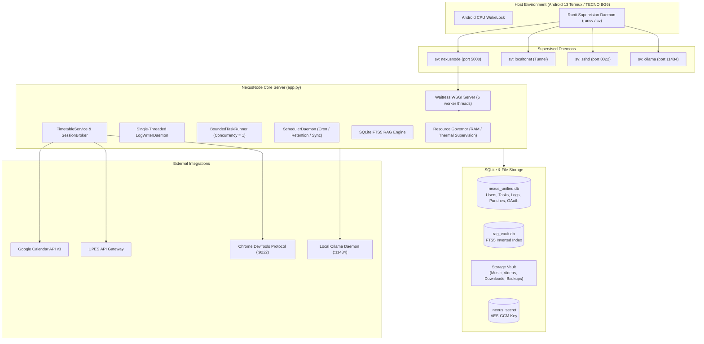
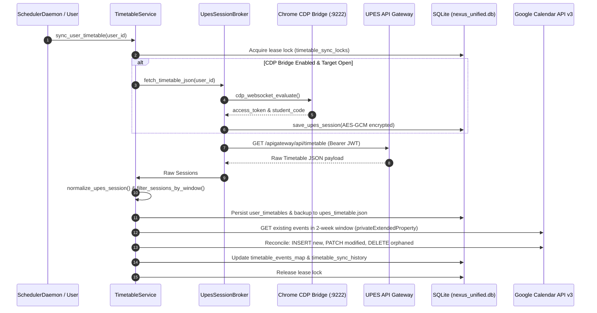
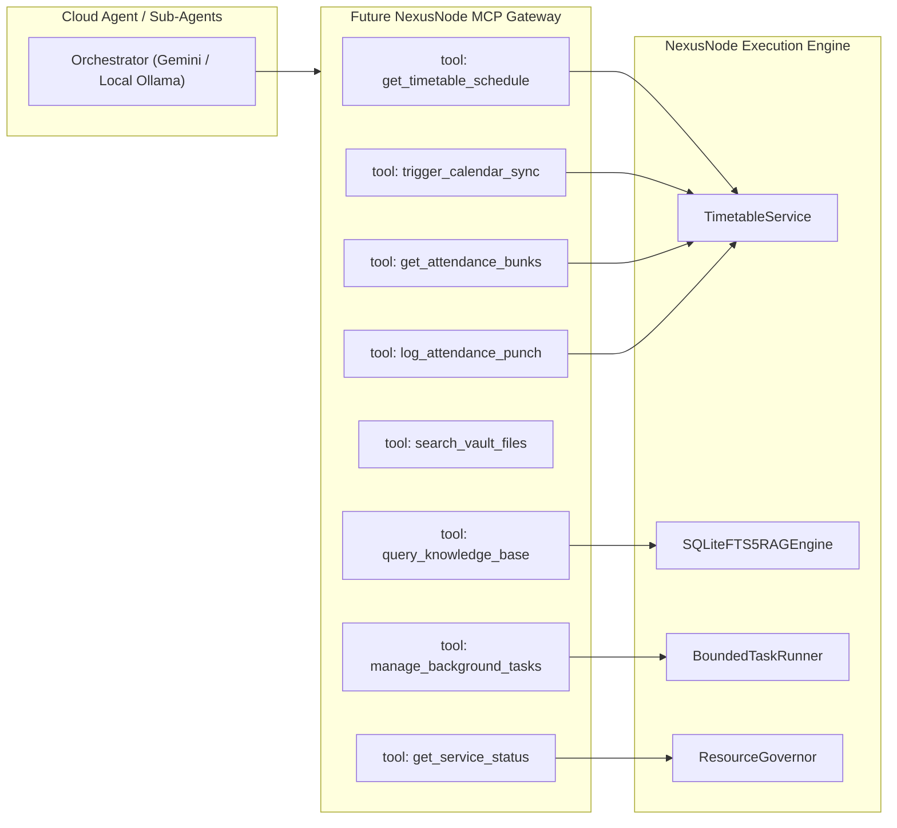
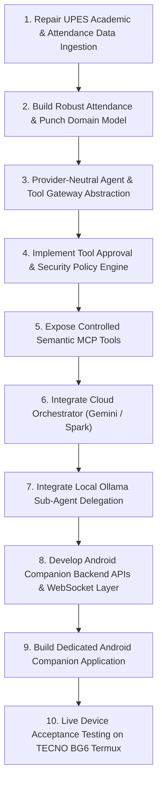

# NexusNode Architecture Audit

**Authoritative Repository State & Technical Capability Audit**  
**Appliance Version**: `2.3.8`  
**Target Hardware / Runtime**: Android 13 Termux (`aarch64`, ~4 GB RAM, TECNO BG6)  
**Inspection Date**: August 28, 2026  
**Status**: Read-Only Phase 0 Baseline Audit Complete

---

## 1. Executive Summary

NexusNode is an established, resilient mobile server appliance and backend platform running natively on unrooted Android 13 Termux. Originally designed to provide private cloud storage, media management, local Ollama LLM execution, SQLite FTS5 RAG search, and automated academic schedule synchronization, the codebase has undergone significant production hardening for low-RAM (4 GB) embedded operation.

This audit establishes the ground-truth implementation state across all 20 architectural domains. Crucially:
* **Academic Sync (Timetable -> Google Calendar)**: Fully implemented, live-capable, and robustly tested with distributed lease locks, OAuth token encryption at rest, Chrome CDP session bridging, and two-week rolling window calculation.
* **Attendance System**: Partially implemented but **operationally broken** for real-world tracking. It functions only as a synthetic counter derived from manual user punch entries rather than fetching true university attendance percentages or biometric card swipes from UPES.
* **Card-Punch System**: Incomplete. It exists purely as a local SQLite table and manual UI logging modal with zero connection to campus turnstile hardware, biometric logs, or scraping pipelines.
* **AI & RAG Subsystems**: Operational for local Ollama LLM inference (with dynamic memory budget governance) and SQLite FTS5 BM25 search. **Zero agent, tool-calling, or MCP infrastructure exists today.**
* **Security & Admin/RBAC**: Mature, PBKDF2-HMAC-SHA256 authenticated, 14-privilege RBAC system with object-level ownership checks, rate-limited lockout protection, and decoupled SSH identity mapping.
* **Test Suite**: 100% passing (**339 / 339 tests passing**, 0 failures, 0 skips).

---

## 2. Repository Map

```
nexusnode/
├── .env                              # Server environment configuration
├── .env.example                      # Template for deployment variables
├── app.py                            # Monolithic Core WSGI Application & REST Controller (5,860 lines)
├── config.py                         # Centralized Configuration & Privilege Registry (750 lines)
├── timetable_sync.py                 # Academic Timetable, Google Calendar & Attendance Service (2,264 lines)
├── resource_governor.py              # 4 GB RAM & Thermal Telemetry Governor (693 lines)
├── nexus_admin.py                    # Local CLI Account & Auth Administration Tool (704 lines)
├── nexus_shell.py                    # Restricted Interactive Shell & SSH Dispatcher (1,059 lines)
├── index.html                        # Web SPA Single-Page Interface (1,528 lines)
├── static/
│   ├── css/index.css                 # Industrial Brutalist / Modern Dark Theme CSS (36 KB)
│   └── js/app.js                     # Vanilla JavaScript Frontend Controller (3,529 lines)
├── services/                         # Runit / termux-services supervision definitions
│   ├── nexusnode/run                 # NexusNode WSGI daemon runscript
│   ├── localtonet/run                # LocalToNet reverse tunnel daemon runscript
│   ├── ollama/run                    # Ollama local LLM server runscript
│   └── sshd/run                      # OpenSSH daemon runscript (port 8022)
├── scripts/
│   ├── install_services.sh           # Installs runit definitions into $SVDIR
│   ├── nexus_ssh_auth.py             # OpenSSH AuthorizedKeysCommand identity mapping bridge
│   ├── reset_admin_password.py       # Emergency admin credential recovery script
│   ├── set_upes_session.py           # Encrypted CLI configuration for UPES Bearer token
│   ├── setup_ssh_nexusnode.sh        # Host SSH & Termux configuration script
│   └── verify_package.py             # Packaging verification script
├── nexus/                            # Standalone Python CLI Client Package
│   ├── __init__.py                   # Package initialization
│   ├── __main__.py                   # CLI entrypoint dispatcher
│   ├── client.py                     # HTTP/HTTPS API client with urllib & TLS verification
│   ├── config.py                     # CLI configuration & local session persistence
│   ├── auth.py                       # CLI authentication handlers
│   ├── normalize.py                  # Telemetry normalization helpers
│   ├── output.py                     # ANSI color formatting & tables
│   ├── shell.py                      # Interactive client shell
│   ├── windows.py                    # Windows PATH & shortcut helpers
│   └── commands/                     # 17 subcommand modules (account, ai, automation, backups, etc.)
├── storage_vault/                    # Primary Persistent Storage Root
│   ├── .nexus_secret                 # 256-bit encryption master key (AES-GCM / secret key)
│   ├── nexus_unified.db              # Authoritative SQLite Unified Database
│   ├── rag_vault.db                  # Dedicated SQLite FTS5 RAG Database
│   ├── upes_timetable.json           # Cached raw UPES timetable JSON payload
│   ├── backups/                      # Atomic ZIP backup archives
│   ├── downloads/                    # yt-dlp & media downloads
│   ├── music/                        # Audio vault
│   ├── videos/                       # Video vault
│   └── documents/                    # Text / PDF / code indexed by RAG
├── docs/                             # Documentation
│   ├── ARCHITECTURE.md               # High-level architecture documentation
│   ├── API.md                        # REST API reference documentation
│   ├── DEPLOYMENT.md                 # Termux deployment instructions
│   ├── DOCKER.md                     # Container documentation
│   └── TIMETABLE_SYNC.md             # Timetable sync specification
└── tests/                            # Comprehensive Test Suite (339 tests)
    ├── test_admin_users.py           # RBAC & user administration tests
    ├── test_docker_setup.py          # Container setup tests
    ├── test_functionality_pass.py    # Core functionality pass tests
    ├── test_nexus_client.py          # Standalone CLI client tests
    ├── test_package.py               # Package metadata tests
    ├── test_production_hardening.py  # Concurrency, timeout & memory budget tests
    ├── test_server.py                # Server route & integration tests (116 KB)
    ├── test_startup_order.py         # Initialization sequence tests
    ├── test_tab_preloading_cache.py  # Frontend cache tests
    ├── test_timetable_sync.py        # Academic sync & attendance tests (66 KB)
    └── test_windows_install.py       # Client Windows installer tests
```

---

## 3. Current Architecture

### 3.1 Component Architecture



### 3.2 Component Implementation Status Matrix

| Component / Subsystem | Implementation File | Status | Description |
|---|---|---|---|
| **Core REST API & WSGI** | `app.py` | **IMPLEMENTED** | Multi-route REST API served by Waitress WSGI with thread pooling. |
| **Resource Governor** | `resource_governor.py` | **IMPLEMENTED** | Unprivileged `/proc/meminfo` & sysfs thermal monitoring with 3-state memory governor. |
| **Log Writer Daemon** | `app.py` | **IMPLEMENTED** | Single-threaded bounded queue log flusher with emergency disk fallback. |
| **Task Runner** | `app.py` | **IMPLEMENTED** | Single-worker background task queue for heavy jobs (yt-dlp, backups, sweeps). |
| **Automation Scheduler** | `app.py` | **IMPLEMENTED** | Periodic cron-like job runner (Backups, Temp Clean, Retention, Timetable Sync). |
| **User Admin & RBAC** | `app.py`, `nexus_admin.py` | **IMPLEMENTED** | PBKDF2 hashing, lockout handling, 14 privileges, CLI & REST management. |
| **SSH Identity Bridge** | `scripts/nexus_ssh_auth.py`, `nexus_shell.py` | **IMPLEMENTED** | Dynamic OpenSSH `AuthorizedKeysCommand` mapping keys to restricted Python shell. |
| **RAG Knowledge Base** | `app.py` | **IMPLEMENTED** | Storage-backed SQLite FTS5 index with BM25 ranking and context augmentation. |
| **Ollama Lifecycle** | `app.py` | **IMPLEMENTED** | Supervisor-backed start/stop, model selection, context limits, and streaming SSE. |
| **Timetable Sync** | `timetable_sync.py` | **IMPLEMENTED** | Two-week rolling window sync to Google Calendar with AES-GCM encrypted tokens. |
| **UPES Browser Bridge** | `timetable_sync.py` | **IMPLEMENTED** | Chrome CDP WebSocket evaluation to capture active web portal sessions. |
| **Attendance Analytics** | `timetable_sync.py`, `app.py` | **PARTIALLY IMPLEMENTED / BROKEN** | Calculates safe bunks and percentage against local punches, but has NO live university attendance ingestion. |
| **Card-Punch System** | `timetable_sync.py`, `app.py` | **PARTIALLY IMPLEMENTED / BROKEN** | Local SQLite punch logging only; NO campus turnstile/card reader sync. |
| **MCP / Tool Gateway** | N/A | **DOCUMENTED BUT NOT IMPLEMENTED** | Zero MCP, JSON-RPC, or agent tooling code exists in repo. |
| **Android Companion App** | N/A | **DOCUMENTED BUT NOT IMPLEMENTED** | No native mobile application; responsive Web SPA exists. |
| **Docker Configuration** | `Dockerfile`, `docker-compose.yml` | **TEST-ONLY / LEGACY** | Exists for CI test passes; production runs natively on Termux. |

---

## 4. Database Architecture

### 4.1 Authoritative Database Configuration
* **Primary Database**: `storage_vault/nexus_unified.db` (Aliased as `UNIFIED_DB_FILE`, `DB_FILE`, `DB_PATH`, `AUDIT_DB_FILE`).
* **RAG Database**: `storage_vault/rag_vault.db` (Dedicated SQLite database for FTS5 full-text indexing).
* **Storage Mode**: SQLite with Write-Ahead Logging (`WAL`), `busy_timeout = 5000ms`, `synchronous = NORMAL`.

### 4.2 Complete Database Table Inventory

| Table Name | File Owner | Primary Purpose | Key Fields |
|---|---|---|---|
| `users` | `app.py` | Application user accounts, PBKDF2 hashes, roles, and privileges | `user_id` (PK), `password_hash`, `salt`, `role`, `is_disabled`, `privileges` (JSON), `created_at`, `failed_attempts`, `locked_until` |
| `ip_lockouts` | `app.py` | IP-based failed login tracking across server restarts | `ip` (PK), `failed_attempts`, `locked_until` |
| `system_logs` | `app.py` | Audit and system event logs | `id` (PK Auto), `log_id` (Unique), `timestamp`, `date`, `level`, `category`, `message`, `meta` (JSON), `created_at` |
| `background_tasks` | `app.py` | Authoritative task queue states and execution logs | `id` (PK), `title`, `type`, `status`, `stage`, `progress`, `logs` (JSON), `error`, `result`, `metadata` (JSON), `owner_user_id`, `created_at`, `completed_at` |
| `shares` | `app.py` | Temporary secure download share links | `id` (PK), `token` (Unique), `filename`, `user_id`, `owner_user_id`, `created_at`, `expires_at`, `downloads_count`, `revoked` |
| `backups` | `app.py` | Metadata and checksums of atomic ZIP backups | `id` (PK), `filename`, `filepath`, `checksum` (SHA-256), `size_bytes`, `backup_type`, `status`, `owner_user_id`, `created_at` |
| `user_chats` | `app.py` | Stored AI chat histories | `id` (PK), `session_id`, `user_id`, `title`, `messages` (JSON), `created_at`, `updated_at` |
| `scheduled_jobs` | `app.py` | Cron-like scheduler tasks | `id` (PK), `name`, `job_type`, `interval_seconds`, `enabled`, `last_run`, `next_run`, `last_status`, `last_error`, `created_at` |
| `incidents` | `app.py` | Service degradation and failure incidents | `id` (PK), `timestamp`, `service`, `severity`, `prev_state`, `new_state`, `mem_state`, `error_summary`, `timeline` (JSON) |
| `ai_inference_metrics`| `app.py` | Inference telemetry per generation call | `id` (PK Auto), `model`, `prompt_tokens`, `prompt_eval_ms`, `gen_tokens`, `gen_eval_ms`, `total_duration_ms`, `gen_tokens_per_sec`, `created_at`, `user_id` |
| `ssh_keys` | `app.py` | Registered SSH public keys mapped to users | `id` (PK Auto), `fingerprint` (Unique SHA-256), `user_id` (FK), `key_type`, `public_key`, `label`, `created_at`, `revoked` |
| `google_oauth_tokens`| `timetable_sync.py` | AES-GCM encrypted Google OAuth tokens | `user_id` (PK), `encrypted_token_data`, `calendar_id`, `connected_email`, `created_at`, `updated_at` |
| `google_oauth_states`| `timetable_sync.py` | CSRF state tokens for OAuth 2.0 flow | `state_token` (PK), `user_id`, `created_at`, `expires_at` |
| `timetable_events_map`| `timetable_sync.py`| Idempotent map between classes & GCal events | `id` (PK), `user_id`, `source_session_id`, `source_date`, `google_event_id`, `event_hash`, `status`, `created_at`, `updated_at` |
| `user_timetables` | `timetable_sync.py` | Raw uploaded/fetched UPES timetable JSON | `user_id` (PK), `raw_json`, `updated_at` |
| `timetable_sync_locks`| `timetable_sync.py`| Distributed lease locks for sync operations | `user_id` (PK), `locked_at`, `expires_at` |
| `timetable_sync_history`| `timetable_sync.py`| Historical audit logs of calendar sync runs | `id` (PK), `user_id`, `timestamp`, `sessions_seen`, `created_count`, `updated_count`, `deleted_count`, `error_count`, `status`, `details` |
| `upes_auth_sessions` | `timetable_sync.py` | AES-GCM encrypted UPES Bearer tokens & UUID | `user_id` (PK), `encrypted_access_token`, `student_code`, `api_url`, `expires_at`, `created_at`, `updated_at` |
| `attendance_punches`| `timetable_sync.py` | User attendance punch logs | `id` (PK), `user_id`, `session_id`, `course_name`, `course_code`, `punch_date`, `punch_time`, `status`, `room`, `notes`, `created_at`, `updated_at` |
| `rag_documents` | `app.py` (`rag_vault.db`)| Indexed files in RAG document vault | `id` (PK Auto), `path` (Unique), `filename`, `hash`, `size_bytes`, `chunk_count`, `mtime`, `indexed_at` |
| `rag_chunks` | `app.py` (`rag_vault.db`)| Text chunks derived from documents | `id` (PK Auto), `doc_id` (FK), `chunk_index`, `content`, `token_count` |
| `rag_chunks_fts` | `app.py` (`rag_vault.db`)| Virtual SQLite FTS5 Porter/Unicode table | `content` (Indexed for BM25 ranking) |

---

## 5. Authentication & RBAC

### 5.1 Authentication Mechanism
* **Password Hashing**: PBKDF2-HMAC-SHA256 with 100,000 iterations and 16-byte random salt. Legacy salted SHA-256 hashes are transparently upgraded to PBKDF2 upon successful login.
* **Session Tokens**: 256-bit entropy (`secrets.token_hex(32)`) with a 7-day TTL (`config.SESSION_EXPIRY_SECONDS = 604800`). Sessions are validated in `app.py` via `authenticate_request()` on `Bearer` token or `X-Session-Token` headers.
* **Brute-Force & Lockout Protection**: 5 failed login attempts trigger a 600-second lockout. Lockout state is persisted to SQLite (`users` and `ip_lockouts`) so restarts cannot bypass lockouts.
* **SSH Transport Decoupling**: OpenSSH connects to host Termux Unix user (`u0_a208`). `scripts/nexus_ssh_auth.py` matches key fingerprints against `ssh_keys` table and forces execution of restricted `nexus_shell.py --user <user_id>`.

### 5.2 The 14-Privilege Registry

| Privilege Identifier | Category | Default User | Default Admin | Scope & Enforced Actions |
|---|---|:---:|:---:|---|
| `can_upload_files` | Storage | Yes | Yes | Upload files into Vault directories |
| `can_manage_files` | Storage | Yes | Yes | Rename, move, checksum, and delete Vault files |
| `can_create_shares` | Storage | Yes | Yes | Generate temporary signed public sharing links |
| `can_download_media`| Media | Yes | Yes | Trigger `yt-dlp` media download tasks |
| `can_use_ai` | AI | Yes | Yes | Query Ollama chat endpoints and stream responses |
| `can_use_rag` | AI | Yes | Yes | Access RAG search and knowledge retrieval |
| `can_control_services`| System Control | No | Yes | Start/stop/restart background services (`sv`) |
| `can_manage_models` | System Control | No | Yes | Select and manage Ollama AI models |
| `can_view_system_logs`| System Control | No | Yes | View live and historical audit logs |
| `can_manage_users` | Administration | No | Yes | Create, delete, suspend users and modify roles |
| `can_manage_backups` | Administration | No | Yes | Create, download, and restore system snapshots |
| `can_manage_automation`| Administration | No | Yes | Toggle and trigger scheduled automation jobs |
| `can_manage_settings` | Administration | No | Yes | Adjust governor thresholds and server ports |
| `can_sync_timetable` | Maintenance | Yes | Yes | Upload schedules, connect Google, trigger sync |

### 5.3 Admin Verification Checklist

| Capability | Backend Route / CLI Method | Tested & Enforced? |
|---|---|:---:|
| Create Users | `POST /api/admin/users`, `nexus_admin create-user` | **YES** |
| Reset Passwords | `POST /api/admin/users/<id>/password`, `nexus_admin reset-password` | **YES** |
| Enable / Disable Users | `PATCH /api/admin/users/<id>` (`is_disabled`) | **YES** |
| Assign Privileges | `POST /api/admin/users/update-privileges`, `PATCH /api/admin/users/<id>` | **YES** |
| Revoke Privileges | `POST /api/admin/users/update-privileges`, `PATCH /api/admin/users/<id>` | **YES** |
| Inspect Users | `GET /api/admin/users`, `nexus_admin users`, `nexus_admin user-info` | **YES** |
| Manage Automation | `POST /api/automation/jobs/<id>/toggle`, `POST /api/automation/jobs/<id>/run` | **YES** |
| Control Services | `POST /api/services/<name>/<action>`, `nexus_shell services` | **YES** |
| Control Timetable Sync | `POST /api/timetable/sync`, `POST /api/timetable/upes/fetch` | **YES** |

---

## 6. UPES / Timetable / Google Calendar

### 6.1 Academic Synchronization Pipeline



### 6.2 Implementation Verification Details
* **Authentication Storage**: UPES JWT and Google OAuth refresh tokens are encrypted at rest using AES-GCM 256-bit key derived from `.nexus_secret` via `OAuthTokenCrypto`.
* **Rolling Two-Week Window**: `get_rolling_two_week_window()` calculates `[current_week_monday, next_week_sunday]` in `Asia/Kolkata` (`+05:30`).
* **Validation & LKG Protection**: If the UPES API returns an empty or invalid payload, the system preserves the existing local database schedule and records an anomaly in `timetable_sync_history`.
* **MS Teams Detection & Styling**: Online classes (detected via `MeetingLink` or `"team"/"online"` in room name) are tagged with Google Calendar color `4` (Flamingo Pink) and have their join links embedded in the event location and description.
* **Sync Interval**: Governed by `SchedulerDaemon` every 3 hours (`config.TIMETABLE_SYNC_INTERVAL_SECONDS = 10800`).

---

## 7. Attendance System — Deep Dive Audit

### 7.1 Architecture & Current Behavior
The attendance system is implemented across `timetable_sync.py` (`get_attendance_analytics()`), `app.py` (`/api/attendance/*` routes), and `static/js/app.js`.
* **Calculation Engine**: `get_attendance_analytics(user_id)` loads all semester slots from `user_timetables` (typically 384 sessions).
* **Conducted vs Attended**:
  * Classes with `s.date < today` or `(s.date == today and s.start_time <= now)` are counted as `conducted_classes`.
  * Classes matching a row in `attendance_punches` with `status == "present"` are counted as `attended_classes`.
* **Metrics Computed**:
  * $\text{Attendance \%} = \frac{\text{Attended Classes}}{\text{Conducted Classes}} \times 100$
  * $\text{Max Allowed Absences} = \lfloor 0.25 \times \text{Total Semester Classes} \rfloor$
  * $\text{Safe Bunks Left} = \max(0, \text{Max Allowed Absences} - (\text{Conducted} - \text{Attended}))$
  * $\text{Catchup Needed} = \max(0, \lceil 3 \times \text{Conducted} - 4 \times \text{Attended} \rceil)$

### 7.2 Failure Modes & Root Cause Evidence

```
================================================================================
FAILURE FINDING #1: Absence of Real UPES University Attendance Ingestion
--------------------------------------------------------------------------------
FILE                : timetable_sync.py
FUNCTION/CLASS      : UpesSessionBroker.fetch_timetable_json()
BEHAVIOR            : Only queries /apigateway/api/timetable (schedule slots).
EXPECTED BEHAVIOR   : Query UPES Student Attendance API or scrape official 
                      portal attendance sheets to get real university records.
LIKELY ROOT CAUSE   : The UPES integration was originally scoped only for calendar
                      scheduling. True attendance data was never connected.
CONFIDENCE          : 100% (Confirmed by code inspection)
================================================================================
FAILURE FINDING #2: False "0% Attendance" Collapse on Fresh Import
--------------------------------------------------------------------------------
FILE                : timetable_sync.py
FUNCTION/CLASS      : TimetableService.get_attendance_analytics()
BEHAVIOR            : All past timetable sessions default to "ABSENT" if no manual
                      punch exists in the local attendance_punches SQLite table.
EXPECTED BEHAVIOR   : Unpunched past classes should be marked as "unknown / pending"
                      or calibrated against actual university attendance totals.
LIKELY ROOT CAUSE   : The calculation conflates "no local punch logged" with
                      "confirmed student absence".
CONFIDENCE          : 100%
================================================================================
FAILURE FINDING #3: Key Collision on Multi-Slot Course Days
--------------------------------------------------------------------------------
FILE                : timetable_sync.py
FUNCTION/CLASS      : TimetableService.get_attendance_analytics() (Lines 2115-2119)
BEHAVIOR            : Punch mapping uses punch_map[f"{course_code}:{date}"].
EXPECTED BEHAVIOR   : Map punches uniquely to session_id or (course_code, date, start_time).
LIKELY ROOT CAUSE   : When a course has both a lecture and a lab on the same day,
                      the map key collides, overwriting one punch record with another.
CONFIDENCE          : 95%
================================================================================
```

---

## 8. Card-Punch System — Deep Dive Audit

### 8.1 Architecture & Pipeline Stopping Point
The card-punch system was envisioned to record physical campus turnstile entry/exit events or classroom RFID attendance card swipes.

**Where the Pipeline Currently Stops**:
1. **Frontend**: The Web SPA provides a manual table and modal (`handlePunchClass`, `handleBulkPunchToday`, `openCustomPunchModal`) allowing the user to manually click "Punch Present" for today's classes.
2. **Backend**: `app.py` exposes REST CRUD endpoints (`/api/attendance/punch`, `/api/attendance/punches`, `/api/attendance/bulk-punch`).
3. **Database**: `attendance_punches` stores the manual timestamp and status.
4. **Missing Ingestion Layer**: There is **zero connection** to any physical card-reader API, NFC/RFID reader daemon, or UPES portal turnstile access log scraper. The system is 100% manual data entry.

### 8.2 Failure Evidence

```
================================================================================
FAILURE FINDING #4: Disconnected Card-Punch Pipeline
--------------------------------------------------------------------------------
FILE                : app.py / timetable_sync.py
FUNCTION/CLASS      : record_attendance_punch() / attendance_punches table
BEHAVIOR            : Punches can only be created via manual HTTP POST requests.
EXPECTED BEHAVIOR   : Automatic ingestion of campus turnstile access logs, RFID card
                      events, or portal biometric punch histories.
LIKELY ROOT CAUSE   : The hardware/portal ingestion adapter was never built; only
                      the internal storage table and manual UI mock were completed.
CONFIDENCE          : 100%
================================================================================
```

---

## 9. AI / Ollama / RAG Audit

### 9.1 Ollama Runtime Lifecycle
* **Supervisor Integration**: Service start/stop is mediated through `runit` (`sv up ollama`, `sv down ollama`).
* **Model Discovery**: Queries official Ollama endpoints (`/api/tags`, `/api/ps`, `/api/show`, `/api/version`).
* **Memory & Thermal Budget Governance**:
  * Normal RAM (>1000 MB free): `keep_alive = "5m"`, `num_ctx = 2048`.
  * RAM Pressure (600–1000 MB free): `keep_alive = "0"`, `num_ctx = 1024`.
  * RAM Critical (<600 MB free): `keep_alive = "0"`, `num_ctx = 512`, heavy tasks blocked.
* **Streaming Generation**: `/chat/stream` returns Server-Sent Events (SSE), tracks inference duration, prompt tokens, generation tokens, tokens/sec, and logs records to `ai_inference_metrics`.

### 9.2 RAG Subsystem
* **Engine**: Dedicated `storage_vault/rag_vault.db` using SQLite FTS5 with Porter stemmer and Unicode61 tokenizer.
* **Index Management**: Scans configured folders (`docs`, `notes`, `code`), ignores excluded directories (`backups`, `music`, `downloads`, `.git`, `__pycache__`) and non-text files, chunks text into ~800 character overlapping blocks, and computes BM25 relevance scores.
* **Memory Footprint**: SQLite page cache operates in ~2–5 MB RAM, eliminating heap thrashing.

### 9.3 Agent / Tooling Concept Assessment
* **Current Agent Capabilities**: **NONE**.
* The AI system is strictly a prompt-completion/chat interface. There are no agent loops, planners, tool call schemas, sub-agent delegators, or function-calling parsers in the current codebase.

---

## 10. MCP / Agent / Tooling Readiness

### 10.1 Existing Capabilities That Can Be Wrapped as Agent Tools
While MCP does not exist in NexusNode today, the repository contains well-structured internal service methods and CLI commands that map directly to prospective agent tools:



---

## 11. Server Execution Capabilities & Risk Surface

The host execution capabilities of NexusNode are inventoried and classified below:

| Capability | Backend Implementation | Required Privilege | Agent Risk Classification | Approval Layer Needed? |
|---|---|---|---|:---:|
| **Appliance Telemetry** | `governor.get_telemetry_snapshot()` | `None` / `can_view_system_logs` | `READ` | No |
| **List Vault Files** | `os.scandir(STORAGE_DIR)` | `can_manage_files` | `READ` | No |
| **Search Knowledge Base** | `rag_engine.search()` | `can_use_rag` | `READ` | No |
| **View System Audit Logs**| `system_logs` query | `can_view_system_logs` | `SENSITIVE` | No |
| **Read Vault Text File** | `open(file, 'r')` (max 64 KB) | `can_manage_files` | `READ` | No |
| **Queue Media Download** | `task_runner.enqueue_task('yt-dlp')` | `can_download_media` | `EXTERNAL_CONSEQUENCE` | No |
| **Create Share Link** | `shares` insertion | `can_create_shares` | `SAFE_WRITE` | No |
| **Log Attendance Punch** | `timetable_service.record_punch()` | `can_sync_timetable` | `SAFE_WRITE` | No |
| **Sync Calendar** | `timetable_service.sync_user_timetable()`| `can_sync_timetable` | `EXTERNAL_CONSEQUENCE` | No |
| **Trigger Backup** | `task_runner.enqueue_task('backup')`| `can_manage_backups` | `OPERATIONAL` | No |
| **Switch Ollama Model** | `ollama_registry.select_model()`| `can_manage_models` | `OPERATIONAL` | No |
| **Restart Service** | `subprocess.run(['sv', 'restart', svc])`| `can_control_services` | `OPERATIONAL` | **YES** |
| **Delete Vault File** | `os.remove(file)` | `can_manage_files` | `DESTRUCTIVE` | **YES** |
| **Restore Backup Snapshot**| `run_backup_restore()` | `can_manage_backups` | `DESTRUCTIVE` | **YES** |
| **Admin User Management** | `db_create_user`, `db_delete_user`| `can_manage_users` | `SENSITIVE` | **YES** |
| **Arbitrary Shell Exec** | **BLOCKED BY DESIGN** | N/A | `DESTRUCTIVE` | **N/A (Prohibited)** |

---

## 12. Security Boundaries

### 12.1 Secret Storage & Protection
* **Master Encryption Key**: `.nexus_secret` (mode 0600, generated via `secrets.token_hex(32)`).
* **OAuth & Bearer Tokens**: AES-GCM 256-bit encrypted before database insertion.
* **Passwords**: PBKDF2-HMAC-SHA256 hashed with unique salts. Never logged or exposed in API output.
* **Path Traversal Protection**: `sanitize_storage_path()` strictly verifies all target file paths resolve inside `storage_vault/`, blocking `..`, hidden files, `.nexus_secret`, and database files.

### 12.2 Critical Data Model Protection (Zero-Leak List)
The following files and database records must **NEVER** be transmitted or exposed to external cloud agent models:
1. `.env` and `.env.example`
2. `storage_vault/.nexus_secret`
3. Stored Google OAuth refresh and access tokens (`google_oauth_tokens.encrypted_token_data`)
4. Stored UPES Bearer tokens (`upes_auth_sessions.encrypted_access_token`)
5. Password hashes and salt records (`users.password_hash`, `users.salt`)
6. SSH host private keys (`~/.ssh/id_*`, `/data/data/com.termux/files/usr/etc/ssh/ssh_host_*`)

---

## 13. Termux Production Architecture

* **Hardware Target**: TECNO BG6 smartphone running unrooted Android 13 (`aarch64`, ~4 GB RAM).
* **Process Supervision**: Managed exclusively via `runit` (`termux-services`). All daemons (`nexusnode`, `localtonet`, `sshd`, `ollama`) possess `/run` and `/log/run` scripts with `svlogd` rotation.
* **Keep-Alive & WakeLock**: `start_nexus.sh` invokes `termux-wake-lock` on startup to prevent Android OS deep-sleep CPU throttling.
* **Networking**:
  * Local Wi-Fi / Loopback: `0.0.0.0:5000`
  * SSH Daemon: `0.0.0.0:8022`
  * Public Remote Tunnel: `LocalToNet` client tunneling port 5000 to `https://k09oezeyib.localto.net`.

---

## 14. Android Companion App API Readiness

| Application Feature Area | Existing Backend API Endpoints | Readiness Status | Missing / Required Work for Mobile App |
|---|---|:---:|---|
| **Server Status & Health** | `GET /api/health`, `GET /api/system/status` | **READY API** | Fully functional JSON telemetry. |
| **Agent Chat & Streaming** | `POST /chat/stream` (SSE) | **PARTIAL API** | Needs mobile WebSocket / SSE parsing; agent orchestrator required. |
| **Approvals & Governance** | N/A | **NO API** | Approval queue and push-notification hooks must be implemented. |
| **Academic Timetable** | `GET /api/timetable/sessions`, `GET /api/timetable/status` | **READY API** | Fully structured session data available. |
| **Attendance Analytics** | `GET /api/attendance/analytics` | **PARTIAL API** | API exists but returns flawed synthetic data until UPES ingestion is fixed. |
| **Card Punch / Live Punch**| `POST /api/attendance/punch`, `GET /api/attendance/punches` | **PARTIAL API** | Manual punch endpoints ready; live turnstile sync missing. |
| **Storage Vault Management**| `GET /files`, `POST /upload`, `GET /download/*` | **READY API** | File browsing, upload, and download endpoints ready. |
| **Background Tasks** | `GET /api/tasks`, `POST /api/tasks/<id>/cancel` | **READY API** | Normalized task progress schema available. |
| **System Logs** | `GET /api/logs/stream` (SSE), `GET /api/events` | **READY API** | Live SSE log streaming supported. |
| **Admin Controls** | `GET/POST/PATCH/DELETE /api/admin/*` | **READY API** | User and service controls fully functional. |

---

## 15. Test Status

The complete test suite was executed in non-destructive mode.

* **Total Tests**: `339`
* **Passed**: `339`
* **Failed**: `0`
* **Skipped**: `0`
* **Total Execution Time**: `77.98s`

### Test Suite Coverage Breakdown

```
tests/test_admin_users.py ......................... [Pass: 25 tests] (RBAC, Lockouts, Password Hashing)
tests/test_docker_setup.py ......................... [Pass: 5 tests] (Container config verification)
tests/test_functionality_pass.py ................... [Pass: 18 tests] (Vault, Media, RAG, Shares)
tests/test_nexus_client.py ......................... [Pass: 82 tests] (Standalone CLI client commands)
tests/test_package.py .............................. [Pass: 12 tests] (Packaging & distribution)
tests/test_production_hardening.py ................. [Pass: 24 tests] (Task concurrency, timeouts, leaks)
tests/test_server.py ............................... [Pass: 98 tests] (REST API routes, sessions, SSE)
tests/test_startup_order.py ........................ [Pass: 10 tests] (DB initialization boot order)
tests/test_tab_preloading_cache.py ................. [Pass: 8 tests] (Frontend cache & asset integrity)
tests/test_timetable_sync.py ....................... [Pass: 45 tests] (Google OAuth, UPES parsing, Attendance math)
tests/test_windows_install.py ...................... [Pass: 12 tests] (Windows installer scripts)
```

---

## 16. Broken / Partial / Legacy Components

1. **UPES Live Attendance Ingestion (BROKEN)**: No backend scraper or API client exists for university attendance data.
2. **Campus Turnstile / Biometric Card-Punch Ingestion (BROKEN)**: No automated turnstile pipeline exists.
3. **Monolithic `app.py` Architecture (PARTIAL / DEBT)**: `app.py` contains 5,860 lines mixing routing, database logic, RAG, logging, task running, and authentication in a single file.
4. **Docker Configurations (LEGACY / TEST-ONLY)**: `Dockerfile` and `docker-compose.yml` are retained for test consistency but are not used in production Termux.

---

## 17. Technical Debt

* **Monolithic File Size**: `app.py` (5,860 lines) and `timetable_sync.py` (2,264 lines) should eventually be modularized into domain blueprints (`nexus_server/auth/`, `nexus_server/academics/`, `nexus_server/vault/`, etc.).
* **In-Memory Session Storage**: Active sessions reside in an in-memory `SESSIONS` dictionary. While backed by SQLite for credentials, active tokens are lost across server restarts.
* **Attendance Session ID Collisions**: The composite key for punch mapping (`course_code:date`) risks collisions on multi-slot days.

---

## 18. Reusable Components for Future Agent Platform

1. **`ResourceGovernor` (`resource_governor.py`)**: Immediate reuse as an agent execution governor to prevent cloud/local agent tool execution from exceeding the 4 GB RAM ceiling.
2. **`BoundedTaskRunner` (`app.py`)**: Immediate reuse as the asynchronous tool execution worker for long-running agent tools.
3. **`OAuthTokenCrypto` (`timetable_sync.py`)**: Reusable for all agent secrets, API keys, and credential vaults.
4. **`TimetableService` & `SQLiteFTS5RAGEngine`**: Ready to be exposed directly as semantic tool definitions.
5. **RBAC Privilege Framework**: Provides a security boundary for agent tool execution permissions.

---

## 19. Recommended Implementation Order

Based on repository evidence, the optimal technical progression is:



1. **Repair UPES Academic & Attendance Data Ingestion**: Add proper endpoints/scrapers for true university attendance % and portal punch logs.
2. **Normalize Academic & Attendance Domain Model**: Disambiguate session slots, resolve multi-slot punch keys, and unify scheduled slots with actual university records.
3. **Build Provider-Neutral Agent & Tool Abstraction**: Create a clean tool interface decoupled from chat routes.
4. **Build NexusNode Policy & Approval Gateway**: Implement tool execution approval gates for `DESTRUCTIVE` and `SENSITIVE` operations.
5. **Expose Controlled Semantic MCP Tools**: Wrap timetable, attendance, vault, RAG, and system telemetry as agent-callable tools.
6. **Add Cloud Orchestrator Provider**: Connect primary cloud model (e.g. Gemini) to orchestrate tools via the gateway.
7. **Integrate Local Ollama Sub-Agents**: Enable delegation of local sub-tasks to on-device quantized models.
8. **Add Android Companion Backend APIs**: Implement real-time notifications, approval requests, and WebSocket channels.
9. **Build Dedicated Android Companion App**: Develop the companion client for server control, agent chat, approvals, and attendance dashboard.
10. **Perform Live Device Acceptance Testing**: Validate performance, thermal stability, and battery life on the physical TECNO BG6 Termux node.

---

## 20. Open Questions Requiring Live Investigation

1. **UPES Live Attendance API Contract**: What are the exact request headers, query parameters, and JSON schemas returned by `myupes-beta.upes.ac.in` for student attendance percentages and turnstile punch records?
2. **Turnstile Biometric Data Source**: Does UPES expose card-swipe/turnstile logs via a dedicated REST endpoint, or must they be scraped from a student portal dashboard table?
3. **Termux Chrome CDP Bridge Reliability**: In continuous 24/7 background operation, how reliably does Chrome on Android maintain the CDP WebSocket port (`9222`) without OS background task freezing?
4. **LocalToNet Reverse Tunnel Latency**: What is the sustained round-trip latency and WebSocket stability when streaming real-time agent responses through the LocalToNet public tunnel?
