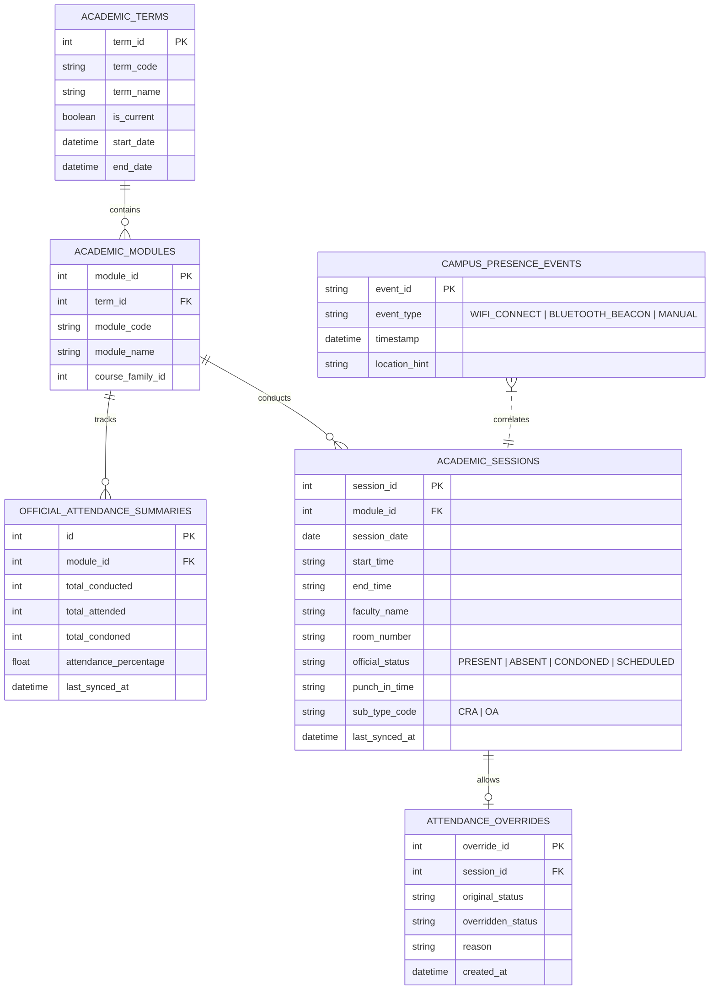
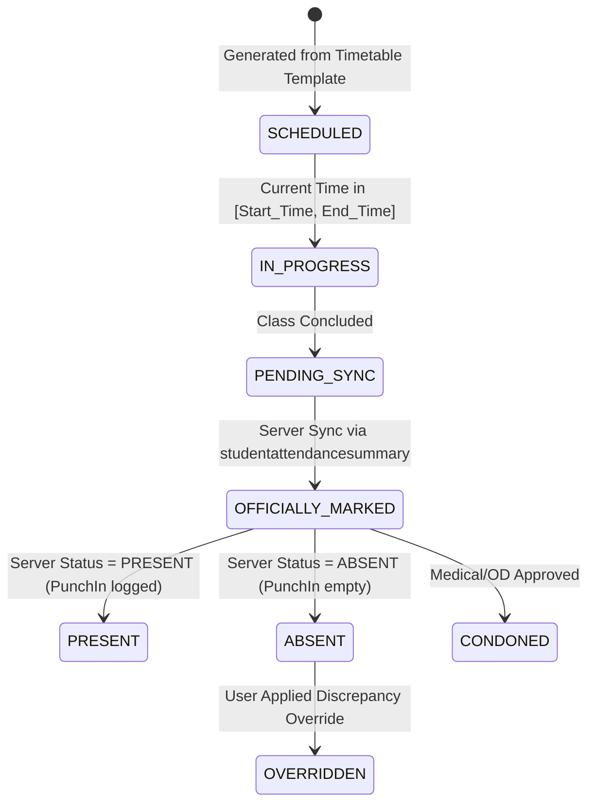

# UPES Attendance & Card-Punch Discovery Report

**Author / Investigator**: NexusNode Engine  
**Audit Date**: 2026-08-28  
**Portal Target**: `https://myupes-beta.upes.ac.in/connectportal`  
**API Gateway**: `https://myupes-beta.upes.ac.in/apigateway`  
**Investigation Status**: COMPLETED (LIVE VERIFIED VIA AUTHENTICATED CDP)

---

## 1. Executive Summary

This investigation established the **real authoritative data sources** for student attendance and card-punch records within the UPES Connect Portal ecosystem (`myupes-beta.upes.ac.in`).

Prior to this discovery, NexusNode operated under several critical misconceptions:
1. **The Timetable Fallacy**: Assumed `/api/timetable` contained actual attendance records (it only contains scheduled class slots).
2. **The Local Punch Fallacy**: Assumed local manual entries in `attendance_punches` were ground truth, and incorrectly marked scheduled classes lacking local punches as *confirmed absences*.
3. **The Card-Punch Ambiguity**: Assumed "card punch" represented campus turnstile/gate entry, when in reality UPES card swipes are **Classroom RFID Reader Punches** logged per academic lecture.

Through authenticated browser DevTools inspection, we discovered the real, official UPES attendance microservice endpoints (`/student-attendance/attendancedropdown` and `/student-attendance/studentattendancesummary`). These endpoints provide both **aggregate course-level statistics** and **granular session-by-session logs** with exact lecture timestamps, classroom numbers, faculty names, punch-in times, and official status (`PRESENT`, `ABSENT`, `CONDONED`).

---

## 2. Portal Architecture & Navigation Discovery

### 2.1 Web Application Architecture
* **Frontend Framework**: Angular 15+ (Ivy engine, production-minified bundle `main.24f924852ff4e0dd.js`).
* **UI Component Library**: Kendo UI for Angular (`kendo-dropdownlist`, `kendo-datepicker`, `kendo-grid`).
* **Micro-Frontend / Gateway**: .NET Core microservices routed via API Gateway (`/apigateway/*`).
* **Active Base Routes**:
  - Dashboard: `/connectportal/user/student/home/dashboard`
  - Attendance: `/connectportal/user/student/student-attendance`
  - Timetable: `/connectportal/user/student/curriculum-scheduling`

### 2.2 Navigation Drawer Discovery
Inspection of the docked sidebar (`nav#docked_sidebar`) revealed 13 active student navigation modules:
1. `Dashboard` (`/connectportal/user/student/home/dashboard`)
2. `Student Attendance` (`/connectportal/user/student/student-attendance`)
3. `Time Table` (`/connectportal/user/student/curriculum-scheduling`)
4. `Hostel Management` (`/connectportal/user/student/hostel-management` — passes, room allocation)
5. `Student Profile` (`/connectportal/user/student/student-profile`)
6. `Circulars` (`/connectportal/user/student/circulars`)
7. `Course Selection` (`/connectportal/user/student/course-selection`)
8. `Hall Ticket` (`/connectportal/user/student/hall-ticket`)
9. `Transcript` (`/connectportal/user/student/transcript`)
10. `Service Request` (`/connectportal/user/student/service-request`)
11. `Placement Management` (`/connectportal/user/student/placement`)
12. `Feedback` (`/connectportal/user/student/feedback`)
13. `Daily Diary` (`/connectportal/user/student/daily-diary`)

> [!IMPORTANT]
> **Zero Gate/Turnstile Access Modules Exist**: There is no student-facing turnstile, RFID gate entry, or campus swipe log module anywhere in the UPES web portal. Campus gate swipes are restricted to university security systems and are not exposed to student accounts.

---

## 3. Authentication & Session Context

UPES Connect Portal stores student identity and bearer credentials in browser `localStorage`:

### 3.1 Storage Keys & Structure
* **`qW0bzwe6hm4r`** (Session & Identity Container):
  - `Identity.AccessToken`: Bearer JWT (37,800s validity / ~10.5 hours).
  - `Identity.RefreshToken`: Refresh token for OAuth renewal.
  - `UserInfo`: User ID, Student Email, First/Last Name, User Type (`ST = Student`).
* **`eseiYEpHnSfrsJ0f5t`** (Student Profile & Academic Container):
  - `StudentId`: Student Unique UUID (e.g. `3a678d8e-****-****-****-5a3ec6ee4948`).
  - `GlobalId`: SAP Student ID / Roll Number (e.g. `590011794`).
  - `CourseFamilyId`: Degree Program Identifier (`593` for `B.Tech CSE`).
  - `CourseFamilyCode`: `BTECH_CS_CSE`.
  - `TermCode`: `SEM_5` (`Semester 5`).
  - `AcademicYearCode`: `UPES_AY26` (`2026-2027`).
  - `CampusCode`: `DDN` (`UPES Bidholi Campus`).

### 3.2 Required HTTP Headers for API Gateway Calls
Every request to the attendance microservices requires the following headers enforced by Angular's HTTP Interceptor:
```http
Authorization: Bearer <AccessToken>
Content-Type: application/json
x-applicationname: connectportal
x-requestfrom: web
x-appsecret: ku7GUMtyT8er51rTfTc7HC
x-studentUniqueId: <StudentUUID>
```

---

## 4. Official Attendance Data Sources

Two authoritative endpoints provide complete attendance data:

### 4.1 Endpoint 1: Academic Hierarchy & Module Dropdown
* **URL**: `POST https://myupes-beta.upes.ac.in/apigateway/student-attendance/attendancedropdown`
* **Controller**: `IEMS.AcademicsAttendance.Service.Controllers.StudentAttendanceSummary.AttendanceDropdownController`
* **Purpose**: Returns the full degree structure, all enrolled semesters (Sem 1 to current Sem 5), semester start/end date ranges, and list of enrolled `ModuleId`s and `ModuleName`s.

#### Request Schema:
```json
{
  "StudentUniqueID": "<StudentUUID>"
}
```

#### Response Schema:
```json
[
  {
    "CourseFamilyId": 593,
    "CourseFamilyName": "B.Tech CSE",
    "TermDropdownDetailsList": [
      {
        "IsCurrentTerm": true,
        "TermCodeId": 5,
        "TermCode": "Semester 5",
        "TermStartDate": "2026-06-15T05:30:00",
        "TermEndDate": "2026-12-30T05:30:00",
        "ModuleDropdownDetailsList": [
          { "ModuleId": 80955, "ModuleName": "EDGE - Advance Communication" },
          { "ModuleId": 87945, "ModuleName": "Cryptography and Network Security" },
          { "ModuleId": 87946, "ModuleName": "Formal Languages and Automata Theory" },
          { "ModuleId": 87947, "ModuleName": "Object Oriented Analysis and Design" },
          { "ModuleId": 87948, "ModuleName": "Probability, Entropy, and MC Simulation" },
          { "ModuleId": 87949, "ModuleName": "Research Methodology in CS" },
          { "ModuleId": 88742, "ModuleName": "Leadership and Team Building" },
          { "ModuleId": 88877, "ModuleName": "Deep Learning" },
          { "ModuleId": 89088, "ModuleName": "AI and Multimedia" }
        ]
      }
    ]
  }
]
```

---

### 4.2 Endpoint 2: Attendance Summary & Granular Session Ledger
* **URL**: `POST https://myupes-beta.upes.ac.in/apigateway/student-attendance/studentattendancesummary`
* **Controller**: `IEMS.AcademicsAttendance.Service.Controllers.StudentAttendanceSummary.StudentAttendanceSummaryController`
* **Purpose**: Returns aggregate attendance totals AND the full array of individual session records for queried course(s).

#### Request Schema:
```json
{
  "StudentUniqueID": "<StudentUUID>",
  "CourseFamilyId": 593,
  "TermCodeId": 5,
  "CourseList": [
    {
      "ID": 87945,
      "Name": "Cryptography and Network Security"
    }
  ],
  "StartDate": "2026-06-15",
  "EndDate": "2026-08-28",
  "TermStartDate": "2026-06-15",
  "TermEndDate": "2026-12-30"
}
```

#### Response Schema:
```json
{
  "AttendanceSummary": {
    "TotalAttendance": 9,
    "TotalSessionCount": 10,
    "TotalCondonedAttendanceCount": 0,
    "TotalPresentPercentage": 90,
    "TotalPresentPercentageTermWise": 90
  },
  "AttendanceInfo": [
    {
      "CourseId": 87945,
      "CourseName": "Cryptography and Network Security",
      "CohortCode": "",
      "AttendanceDetails": [
        {
          "SessionId": 1076719,
          "SessionDate": "2026-08-27T00:00:00",
          "SessionTime": "17:00 - 17:55",
          "FacultyNames": "Krishnaraj NA",
          "StudentPunchInTime": "",
          "AttendanceStatus": "ABSENT",
          "SessionType": "Regular",
          "AdditionalDetails": {
            "Mode": "Class Room",
            "ClassRoom": "11114",
            "VirtualRoom": "",
            "SessionStatus": "On-Time",
            "Reason": []
          }
        },
        {
          "SessionId": 1076141,
          "SessionDate": "2026-08-25T00:00:00",
          "SessionTime": "12:00 - 12:55",
          "FacultyNames": "Krishnaraj NA",
          "StudentPunchInTime": "12:01",
          "AttendanceStatus": "PRESENT",
          "AttendanceSubTypeCode": "CRA",
          "SessionType": "Regular",
          "AdditionalDetails": {
            "Mode": "Class Room",
            "ClassRoom": "11215",
            "VirtualRoom": "",
            "SessionStatus": "On-Time",
            "Reason": []
          }
        }
      ]
    }
  ]
}
```

---

## 5. Card-Punch & Biometric Semantics Discovery

### 5.1 The "Card Punch" Mechanism in UPES
Live inspection of the session records reveals the exact nature of UPES card punches:
* **RFID Reader Location**: Located **inside each classroom / laboratory**, not at the campus entrance.
* **`AttendanceSubTypeCode: "CRA"`**: Stands for **Classroom Reader Attendance**.
* **`StudentPunchInTime`**: Records the exact minute the student swiped their RFID card at the reader inside the room (e.g. `12:01`, `16:01`, `17:05`).
* **Absent State**: When absent, `StudentPunchInTime` is empty `""`, `AttendanceStatus` is `"ABSENT"`, and `AttendanceSubTypeCode` is null.
* **Online/Alternative Classes**: Marked with `AttendanceSubTypeCode: "OA"` (Online Attendance) with empty classroom string `""`.

### 5.2 Summary of Card-Punch Semantics
| Dimension | Reality in UPES | Previous NexusNode Assumption |
| :--- | :--- | :--- |
| **Physical Source** | In-classroom RFID card reader | Campus turnstile / gate scanner |
| **Data Scope** | Per-session lecture attendance | Daily campus entry/exit events |
| **Authoritative System** | University SAP / IEMS Attendance DB | Local SQLite manual logging |
| **Student Access** | Embedded inside `/studentattendancesummary` session objects | Independent gate log API (Non-existent) |

---

## 6. Live Attendance Audit & Portal Comparison

Comparison between the live API responses and the visible Dashboard widget confirms **100% exact parity**:

| Course Name | Module ID | Live API Attended / Total | Live API % | Dashboard UI % | UI Category | Sample Session ID |
| :--- | :---: | :---: | :---: | :---: | :---: | :---: |
| **Cryptography and Network Security** | 87945 | 9 / 10 | 90.00% | 90% | Ok ($\ge 80\%$) | `1076719` (Absent) |
| **Formal Languages and Automata Theory** | 87946 | 8 / 10 | 80.00% | 80% | Ok ($\ge 80\%$) | `1121709` (Present) |
| **Object Oriented Analysis and Design** | 87947 | 6 / 7 | 85.71% | 85.71% | Ok ($\ge 80\%$) | `1125411` (Present) |
| **Probability, Entropy, and MC Simulation**| 87948 | 10 / 10 | 100.00% | 100% | Ok ($\ge 80\%$) | `1077327` (Present) |
| **Research Methodology in CS** | 87949 | 6 / 8 | 75.00% | 75% | Need Attention ($75-80\%$) | `1077483` (Absent) |
| **Leadership and Team Building** | 88742 | 2 / 2 | 100.00% | 100% | Ok ($\ge 80\%$) | `1222094` (Present) |
| **Deep Learning** | 88877 | 17 / 17 | 100.00% | 100% | Ok ($\ge 80\%$) | `1104822` (Present) |
| **AI and Multimedia** | 89088 | 1 / 2 | 50.00% | 50% | Critical ($< 75\%$) | `1224201` (Absent) |
| **EDGE - Advance Communication** | 80955 | 0 / 0 | 0.00% | N/A | Not Started | N/A |

---

## 7. Flaws in Existing NexusNode Attendance Engine

The Phase 0 & Phase 1 investigations revealed the following systemic flaws in NexusNode's previous attendance logic:

1. **`user_timetables` conflation**:
   - `user_timetables` represents a static 7-day recurring weekly timetable schedule, not actual conducted classes.
   - It contains no concept of teacher leaves, cancelled classes, or extra lectures.
2. **`attendance_punches` manual logging fallacy**:
   - The old system expected the user or local agent to write rows to `attendance_punches`.
   - Any scheduled class from `user_timetables` lacking a corresponding local punch was automatically computed as **ABSENT**.
3. **Compound Key Collision**:
   - Previous matching used `course_code:date`. If a course had 2 lectures on the same day (e.g. Theory in morning, Lab in afternoon), the second punch collided or overwrote the first.
   - UPES actually uses a unique integer **`SessionId`** (`1076719`, `1076141`, etc.) which completely eliminates collision risk.
4. **Incorrect Bunk / Recovery Mathematics**:
   - Bunk calculations did not distinguish between officially marked sessions, currently scheduled upcoming sessions, and condoned absences.

---

## 8. Proposed Normalized Domain Model

To achieve a production-grade, authoritative attendance system, NexusNode will implement the following relational schema:



### 8.1 Table Definitions
1. **`academic_terms`**: Tracks semester bounds (`TermCodeId`, `TermStartDate`, `TermEndDate`, `IsCurrentTerm`).
2. **`academic_modules`**: Master list of university courses linked to terms (`ModuleId`, `ModuleName`, `CourseFamilyId`).
3. **`official_attendance_summaries`**: Fast aggregate query table storing official totals (`TotalSessionCount`, `TotalAttendance`, `TotalPresentPercentage`).
4. **`academic_sessions`**: Authoritative session ledger keyed by university **`SessionId`**, tracking exact date, start/end time, faculty name, classroom, punch-in time, and status.
5. **`campus_presence_events`**: Auxiliary local signals (Wi-Fi network connection, BLE beacons, Android phone location) kept separate from official university records.
6. **`attendance_overrides`**: User or advisor discrepancy adjustments (e.g. medical condonations, on-duty slips) without mutating raw server snapshots.

---

## 9. Proposed Calculation & Bunk Policy

All calculations must operate strictly on **Conducted Sessions** ($C$) and **Attended Sessions** ($A$):

### 9.1 Core Attendance Percentage
$$\text{Attendance } \% = \left( \frac{A + \text{Condoned}}{C} \right) \times 100$$

### 9.2 Safe Bunks Remaining ($B$)
The number of future consecutive classes a student can safely miss while keeping attendance $\ge 75\%$:
$$B = \left\lfloor \frac{A - 0.75 \times C}{0.75} \right\rfloor = \left\lfloor \frac{4A - 3C}{3} \right\rfloor$$
*If $B \le 0$, safe bunks = 0.*

### 9.3 Required Classes for Recovery ($R$)
When attendance is below $75\%$ ($C > 0$ and $\frac{A}{C} < 0.75$), the number of consecutive upcoming classes the student must attend to reach $75\%$:
$$R = \left\lceil \frac{0.75 \times C - A}{1 - 0.75} \right\rceil = \lceil 3C - 4A \rceil$$

### 9.4 State Transition Machine for Class Sessions


---

## 10. Security & Privacy Guardrails

1. **No Hardcoded Tokens**: Access tokens and cookies must never be committed to git or printed in raw logs.
2. **Local Session Bridge**: Tokens are extracted ephemeral-only via CDP WebSocket from authenticated browser session (`UpesBrowserSessionBridge`).
3. **Identifier Masking**: UUIDs, Student IDs, and SAP IDs must be masked in telemetry and user-facing agent logs.
4. **Zero State Mutation on University Servers**: All discovery and synchronization operations use read-only HTTP endpoints (`/attendancedropdown` and `/studentattendancesummary`). No mutation forms or university state are ever submitted.

---

## 11. Recommendations for Phase 2 Implementation Plan

When Phase 2 begins, the implementation should proceed in structured steps:
1. **Migration & DB Models**: Implement SQLAlchemy models for `AcademicTerm`, `AcademicModule`, `OfficialAttendanceSummary`, `AcademicSession`, and `AttendanceOverride`.
2. **Sync Client (`attendance_sync.py`)**: Build a dedicated synchronization worker leveraging `UpesBrowserSessionBridge` with automatic fallback to `/student-attendance/*` APIs.
3. **API & Route Migration**: Update NexusNode's internal endpoints (`/api/attendance/*`) to serve real session ledgers, accurate safe-bunk numbers, and discrepancy handling.
4. **Comprehensive Test Suite**: Unit test safe bunk formulas, recovery calculations, and session upsert idempotency with real captured fixtures.
