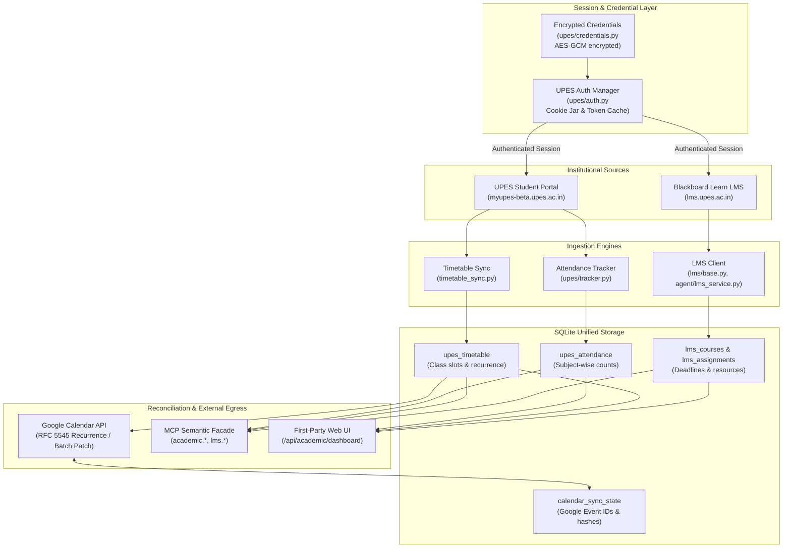
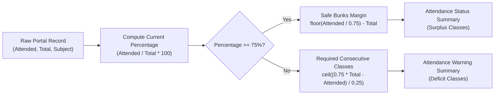

# Academic Architecture Deep-Dive

> **Status**: VERIFIED CURRENT  
> **Scope**: UPES Student Portal integration, Blackboard Learn LMS, attendance tracking/forecasting, and Google Calendar reconciliation  
> **Last verified**: 2026-09-20 (Phase 4.2B Post-Rebase Audit)  
> **Evidence basis**: Verified source code in [`upes/`](file:///e:/Workspace/Active/server/upes), [`lms/`](file:///e:/Workspace/Active/server/lms), [`timetable_sync.py`](file:///e:/Workspace/Active/server/timetable_sync.py), and [`attendance_sync.py`](file:///e:/Workspace/Active/server/attendance_sync.py)

---

## 1. Subsystem Overview

The Academic Subsystem is the operational core of NexusNode. It autonomously interfaces with university student portals and learning management systems to ingest attendance, course rosters, timetable schedules, and academic assignments. It reconciles timetable events with Google Calendar, computes real-time attendance margin projections, and exposes academic intelligence to remote MCP reasoning models.

---

## 2. Institutional Portal Integration

### A. UPES Student Portal (`myupes-beta.upes.ac.in`)
- **Module**: [`upes/auth.py`](file:///e:/Workspace/Active/server/upes/auth.py), [`upes/session.py`](file:///e:/Workspace/Active/server/upes/session.py), [`upes/tracker.py`](file:///e:/Workspace/Active/server/upes/tracker.py).
- **Authentication Flow**:
  1. Student credentials (SAP ID and password) are decrypted from SQLite via AES-GCM ([`upes/crypto.py`](file:///e:/Workspace/Active/server/upes/crypto.py)).
  2. The authentication manager executes a direct POST request to `/oneportal/app/auth/login`.
  3. Session cookies (`JSESSIONID`, `AWSALB`, `AWSALBCORS`) are stored in an encrypted session cookie jar.
  4. Cookies are cached with a configurable TTL; expired sessions trigger automatic re-login.
- **Data Ingestion**:
  - Ingests structured attendance tables across all enrolled subjects.
  - Extracts weekly timetable matrices including subject codes, faculty names, room numbers, and slot timings.

### B. Blackboard Learn LMS (`lms.upes.ac.in`)
- **Module**: [`lms/base.py`](file:///e:/Workspace/Active/server/lms/base.py), [`agent/lms_service.py`](file:///e:/Workspace/Active/server/agent/lms_service.py).
- **Functionality**:
  - Connects via institutional SSO or direct credentials to Blackboard REST endpoints.
  - Ingests active course enrollments, gradebook columns, assignment briefs, and submission deadlines.
  - Exposes assignment metadata for deadline tracking and calendar injection.

---

## 3. Attendance Analytics & Forecasting

Attendance policies at UPES mandate a minimum **75% attendance** per registered course to appear for end-semester examinations. NexusNode implements deterministic analytics to calculate current percentages, safe bunk margins, and required recovery classes.

### Mathematical Formulas

For each course with $A$ attended classes and $T$ total held classes:

1. **Current Attendance Rate**:
   $$\text{Rate} = \frac{A}{T} \times 100\%$$

2. **Safe Bunks Margin** (Classes a student can miss while staying at or above 75%):
   $$\text{Bunks} = \left\lfloor \frac{A}{0.75} \right\rfloor - T \quad (\text{if } \text{Rate} \ge 75\%)$$

3. **Required Recovery Classes** (Consecutive classes a student must attend to reach 75%):
   $$\text{Recovery} = \left\lceil \frac{0.75 \times T - A}{0.25} \right\rceil \quad (\text{if } \text{Rate} < 75\%)$$

These metrics are calculated on the fly and returned in structured JSON by both the `/api/academic/dashboard` REST endpoint and the `academic.analyze` MCP tool.

---

## 4. Google Calendar Reconciliation Engine

The synchronization engine ([`timetable_sync.py`](file:///e:/Workspace/Active/server/timetable_sync.py)) reconciles the university weekly timetable matrix with the student's personal Google Calendar.

### Key Architecture Features
1. **Timezone Normalization**: Strict enforcement of `Asia/Kolkata` (IST, UTC+05:30).
2. **RFC 5545 Recurrence Modeling**: Recurring weekly classes are created with `RRULE:FREQ=WEEKLY;UNTIL=...` spanning the active academic semester.
3. **Drift Detection & Idempotency**:
   - Each event's content (subject, slot, room, faculty) is hashed via SHA-256 and stored in `calendar_sync_state`.
   - Before updating Google Calendar, the engine checks whether the current remote event matches the local hash. Identical events are untouched, avoiding rate-limit exhaustion.
4. **Batch Patch Operations**: Timetable updates and cancellations use batch Google Calendar API requests to minimize network roundtrips.

---

## 5. Background Zero-Touch 3-Hour Automation

To ensure academic intelligence and calendar events remain synchronized:
- **Scheduler**: A background persistent loop executes on a 3-hour cadence (`10,800s` / `scheduled_jobs`).
- **Independent Failure Containment**: Coordinates Timetable/Calendar, Attendance, Academic Results, and LMS telemetry in independent execution blocks. Calendar reconciliation depends exclusively on trustworthy timetable data; failure of Attendance, Results, or LMS never halts or blocks Calendar synchronization.
- **Destructive Protection**: On suspicious or empty upstream responses, deletions are blocked (`allow_deletions = False`) to safeguard Google Calendar events.
- **Zero-Touch Execution**: The worker uses stored encrypted credentials, operating with 0 Chromium browser launches during normal sync cycles.
- For deep architectural details, see [Scheduler and Calendar Architecture](file:///e:/Workspace/Active/server/docs/architecture/SCHEDULER_AND_CALENDAR_ARCHITECTURE.md).

---

## 6. Academic Results & CGPA Subsystem Status: `[DELIVERED & OPERATIONAL]`

> [!NOTE]
> Delivered in Phase 4.3A. The Academic Results, SGPA, CGPA, and What-If analysis engine is fully operational in production across both local workstation and physical TECNO BG6 appliance.

### Operational Subsystem Specifications
- **Authoritative Tables**:
  - `academic_results` (term ID, SGPA, CGPA, credits registered/earned, payload hash, LKG cache state)
  - `academic_result_courses` (course code, title, letter grade, grade points, credits, backlog flag)
  - `academic_result_sync_history` (audit records of synchronization attempts)
- **Production Capabilities**:
  - Dual normalization: ConnectPortal JSON APIs & Exam-Pro tabular transcripts.
  - UPES 10-point scale enforcement with `decimal.Decimal` rounding precision.
  - Automated discrepancy detection between published grade cards and computed metrics.
  - Deterministic What-If GPA simulator modeling required term SGPA to achieve target CGPA.
  - Fully exposed via semantic MCP facade (`academic.query`, `academic.analyze`, `academic.sync`) and first-party Web UI.
- For full design and mathematical formulation, see [Results Architecture](file:///e:/Workspace/Active/server/docs/architecture/RESULTS_ARCHITECTURE.md).

