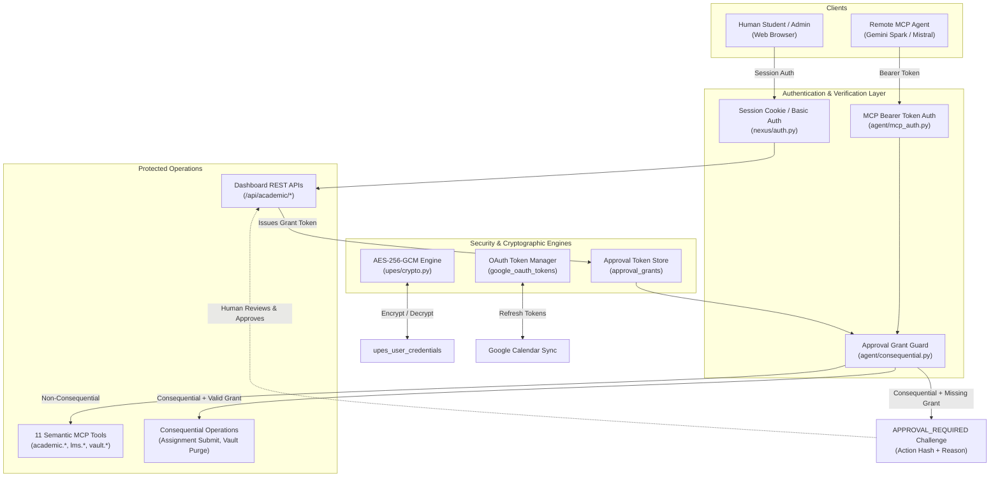

# Authentication & Security Architecture Deep-Dive

> **Status**: VERIFIED CURRENT  
> **Scope**: Authentication protocols, session management, credential cryptography, OAuth token lifecycle, and consequential action guardrails  
> **Last verified**: 2026-09-20 (Phase 4.2B Post-Rebase Audit)  
> **Evidence basis**: Verified source code in [`nexus/auth.py`](file:///e:/Workspace/Active/server/nexus/auth.py), [`agent/mcp_auth.py`](file:///e:/Workspace/Active/server/agent/mcp_auth.py), [`upes/crypto.py`](file:///e:/Workspace/Active/server/upes/crypto.py), and [`agent/consequential.py`](file:///e:/Workspace/Active/server/agent/consequential.py)

---

## 1. Authentication Philosophy

NexusNode operates as an appliance accessed by two distinct client categories:
1. **Human Users**: Accessing the web dashboard via standard browsers.
2. **Autonomous Reasoning Agents**: Accessing the semantic MCP interface via remote LLM connectors (Gemini Spark, Mistral).

Security must enforce strict multi-tenant boundaries, prevent unauthorized exposure of university credentials, and guarantee that no remote LLM can execute destructive or consequential operations without verified human consent.



---

## 2. Human Authentication & Web Dashboard Sessions

- **Mechanism**: [`nexus/auth.py`](file:///e:/Workspace/Active/server/nexus/auth.py).
- **Credentials**: Stored in `users` table with password hashes generated using PBKDF2 with SHA-256 (or Argon2/bcrypt where supported).
- **Session Transport**: HTTP-only, SameSite cookies or explicit `Authorization` headers.
- **Roles**:
  - `student`: Standard access restricted strictly to their own academic records, Google Calendar sync, and personal Vault.
  - `admin`: Elevated access to appliance diagnostics, background worker status, approval requests, and user onboarding.

---

## 3. Remote Agent Authentication (MCP Gateway)

- **Mechanism**: [`agent/mcp_auth.py`](file:///e:/Workspace/Active/server/agent/mcp_auth.py).
- **Transport**: Standard HTTP `Authorization: Bearer <agent_token>` passed on `/mcp/sse` and `/mcp/messages` endpoints.
- **Tenant Context Binding**:
  - The middleware resolves the bearer token against `oauth_tokens` or `agent_tokens`.
  - Upon successful validation, the request context sets `g.user_id` and `g.scopes`.
  - Every subsequent database query and tool invocation inherits this identity automatically.
- **Revocation**: Bearer tokens can be revoked immediately from the admin dashboard without altering master server secrets.

---

## 4. Cryptographic Credential Storage

NexusNode securely stores institutional passwords and SAP IDs in the database to enable background zero-touch synchronization without prompting the user.

- **Module**: [`upes/crypto.py`](file:///e:/Workspace/Active/server/upes/crypto.py), [`upes/credentials.py`](file:///e:/Workspace/Active/server/upes/credentials.py).
- **Cipher**: **AES-256-GCM** (Galois/Counter Mode) providing authenticated encryption with associated data (AEAD).
- **Key Derivation**:
  - Master key is drawn from the environment (`NEXUS_VAULT_KEY` or `SECRET_KEY`).
  - A unique per-user salt is combined with the master key using HKDF (HMAC-based Key Derivation Function).
  - Ciphertexts include random 96-bit initialization vectors (IV) and 128-bit authentication tags.
  - Raw credentials never appear in application logs or unencrypted swap storage.

---

## 5. Google OAuth 2.0 Multi-Tenant Delegation

- **Architecture**: Shared appliance client configuration with isolated user tokens.
- **Configuration**:
  - `GOOGLE_CLIENT_ID` and `GOOGLE_CLIENT_SECRET` configured in `.env`.
- **Per-User Flow**:
  1. Student initiates Google connection in dashboard.
  2. Google consent screen prompts for the `https://www.googleapis.com/auth/calendar.events` scope.
  3. Authorization code exchanged for refresh token and access token.
  4. Encrypted tokens stored in `google_oauth_tokens` table strictly keyed to `user_id`.
  5. The sync worker rotates access tokens automatically using the refresh token; expired tokens trigger user notification.

---

## 6. Consequential Action Guardrails (`ApprovalGrantManager`)

To protect users against rogue or unintended actions by remote AI reasoning models, NexusNode enforces a strict human-in-the-loop authorization gate for consequential actions.

- **Module**: [`agent/consequential.py`](file:///e:/Workspace/Active/server/agent/consequential.py).
- **Consequential Actions**:
  - Submitting assignments or posting content to university portals (`lms.submit`).
  - Purging or deleting documents from the private Vault (`vault.manage` with `action='delete'`).
  - Mutating user credentials or clearing synchronization state.

### Challenge & Grant Protocol
1. **Challenge**: When an MCP tool call attempts a consequential action without an approval grant, NexusNode computes a SHA-256 hash of the exact operation parameters:
   $$\text{action\_hash} = \text{SHA-256}(\text{tool\_name} + \text{user\_id} + \text{canonical\_json\_args})$$
2. The server blocks execution, creates a record in `approval_requests`, and returns an MCP error response:
   ```json
   {
     "error": "APPROVAL_REQUIRED",
     "action_hash": "a4f89b...",
     "description": "Submitting assignment 'Network Security Lab 3' to Blackboard Learn.",
     "message": "Human approval required. Please approve this action on the NexusNode dashboard."
   }
   ```
3. **Approval**: The user visits the dashboard, reviews the pending action details, and clicks "Approve".
4. A cryptographically signed token is stored in `approval_grants` with a 15-minute TTL.
5. **Re-Execution**: The agent repeats the tool call including `"approval_grant": "token_xyz"`. The gate verifies the grant against the action hash and proceeds with execution.
