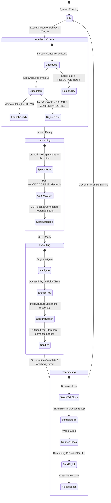

# Ephemeral Browser Architecture Deep-Dive

> **Status**: VERIFIED CURRENT  
> **Scope**: Ephemeral headless Chromium automation, CDP integration, accessibility tree sanitization, and hardware resource governance on the TECNO BG6  
> **Last verified**: 2026-09-20 (Phase 4.2B Post-Rebase Audit)  
> **Evidence basis**: Verified source code in [`browser/`](file:///e:/Workspace/Active/server/browser), runtime benchmarks in `storage_vault/artifacts/benchmarks/phase41a_benchmark_results.json`

---

## 1. Architectural Rationale & Design Principles

The TECNO BG6 is an ARM64 mobile appliance with 3.77 GB of RAM operating on continuous 24/7 power. In earlier iterations, running permanent browser daemons or heavier browser automation frameworks (Playwright/Puppeteer/Selenium) caused severe resource exhaustion, kernel out-of-memory kills (LMK), and zombie processes.

NexusNode solves this via an **Ephemeral Browser Engine**:
1. **Zero Standing Daemons**: Chromium is never left idling in the background. It is spawned on demand for a discrete observation/action cycle and terminated immediately.
2. **Userspace Containerization**: Chromium runs inside a lightweight `proot-distro` Alpine Linux container, isolating browser dependencies and system libraries from Termux's base userspace.
3. **Direct CDP Communication**: NexusNode interfaces directly with Chromium via the WebSocket-based **Chrome DevTools Protocol (CDP)**, eliminating external driver overhead.
4. **Strict Lifecycle Governance**: Every browser invocation is governed by a concurrency lock, a memory admission gate, and a watchdog timer with a process-tree reaper.

---

## 2. Browser Engine Lifecycle



---

## 3. Chrome DevTools Protocol (CDP) Integration

- **Module**: [`browser/bg6_cdp.py`](file:///e:/Workspace/Active/server/browser/bg6_cdp.py), [`browser/cdp_client.py`](file:///e:/Workspace/Active/server/browser/cdp_client.py).
- **Communication Channel**: Connects over WebSocket directly to the CDP port (`127.0.0.1:9222`).
- **Target Domains**:
  - `Page`: Navigation, document lifecycle events (`Page.loadEventFired`), screenshot capture.
  - `DOM`: Element querying, attribute inspection, bounding box calculation.
  - `Accessibility`: Deep structural extraction (`Accessibility.getFullAXTree`).
  - `Input`: Synthetic keystrokes, click dispatching, touch events.
  - `Network`: Cookie injection, user-agent spoofing, header management.

---

## 4. Accessibility Tree Extraction & Sanitization

Rather than parsing multi-megabyte DOM HTML trees, NexusNode extracts Chromium's native **Accessibility Tree (AX Tree)**. This tree represents only the semantic elements perceived by assistive technologies (buttons, inputs, links, headings, tables).

### The AXSanitizer Pipeline (`browser/observation.py`, `agent/sanitizer.py`)

Raw AX trees from university portals frequently span 200–500 KB and contain hundreds of un-rendered or decorative layout containers. The `AXSanitizer` performs recursive filtering:
1. Strips non-interactive structural nodes lacking text or ARIA semantics (`genericContainer`, `none`, `presentation`).
2. Collapses redundant nested text spans into unified strings.
3. Formats the remaining tree into a concise YAML/indented string.

### Measured Empirical Sanitization Performance
(From Phase 4.1A Benchmark Suite on BG6 hardware):

| Metric | Raw CDP Accessibility Tree | Sanitized Tree | Efficiency Gain |
|---|---|---|---|
| **Node Count** | `777 nodes` | `140 nodes` | **82.0% reduction** |
| **Payload Size** | `249,305 bytes (243 KB)` | `6,858 bytes (6.7 KB)` | **97.2% reduction** |
| **LLM Context Budget** | Exceeds typical budget | Easily fits within 50 KB MCP limit | **86.3% headroom** |

---

## 5. Runtime Governance & Resource Safeguards

The browser engine runs with strict safeguards implemented in [`browser/chromium_runtime.py`](file:///e:/Workspace/Active/server/browser/chromium_runtime.py):

### A. Concurrency Mutex Lock
- Enforces an absolute maximum of **1 active browser session** at any time.
- If a secondary tool or user request attempts to invoke the browser concurrently, it is immediately rejected with a `429 RESOURCE_BUSY` status.

### B. Memory Admission Gate
- Prior to process spawning, inspects Linux `/proc/meminfo`.
- **Threshold**: Requires `MemAvailable >= 500 MB`.
- If memory is depressed, the browser launch is aborted, preventing Android's Low Memory Killer (LMK) from killing the NexusNode server.

### C. Watchdog Timer & Process Tree Reaper
- Every browser session is bounded by an asynchronous watchdog timer (default: 30 seconds).
- Upon timeout:
  1. Issues `Browser.close` over CDP.
  2. Sends `SIGTERM` to the Chromium PID group.
  3. Pauses 500 ms; if child processes persist, dispatches recursive `SIGKILL` to all descendant PIDs.
  4. Guarantees **zero orphaned PIDs** survive the execution.

### D. Verified Launch Flags
Chromium is launched inside the Alpine container with the exact flags verified during empirical benchmarking:
```bash
proot-distro login alpine -- chromium \
    --headless \
    --remote-debugging-port=9222 \
    --no-sandbox \
    --disable-dev-shm-usage \
    --disable-software-rasterizer \
    --disable-extensions \
    --window-size=1280,800 \
    --blink-settings=imagesEnabled=true
```
*(GPU disabling flags are not injected unless specifically required by driver regressions).*

---

## 6. Empirical Hardware Benchmarks (Summary)

The engine was verified over 10 consecutive executions on the physical BG6 appliance:
- **Cold Start Time**: Mean `1.97 s` (1,869 ms – 2,095 ms)
- **Navigation Time**: Mean `364.8 ms`
- **Clean Shutdown Time**: Mean `278.8 ms`
- **Host Server Memory Impact**: Python process RSS remained rock-steady at `22–23 MB`; system memory dip during active rendering was only `~119 MB`, fully recovering post-shutdown.
- **Repeatability**: `10 / 10 runs passed` with `0 orphaned PIDs`.
