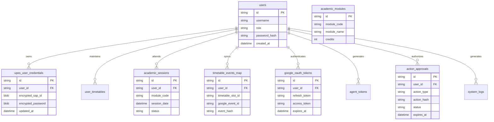

# Database Architecture Deep-Dive

> **Status**: VERIFIED CURRENT  
> **Scope**: SQLite database design, schema topology, pragma tuning, index strategy, and backup mechanisms  
> **Last verified**: 2026-09-20 (Phase 4.2B Post-Rebase Audit)  
> **Evidence basis**: Schema introspection of production database `storage_vault/nexus_unified.db` (5.7 MB) and live fingerprint across 37 tables

---

## 1. Storage Engine Overview

NexusNode relies on a single, unified SQLite 3 database located at [`storage_vault/nexus_unified.db`](file:///e:/Workspace/Active/server/storage_vault/nexus_unified.db). SQLite was chosen over heavy external database servers (PostgreSQL/MySQL) because it operates in-process, has zero client/server network overhead, consumes negligible RAM (<2 MB buffer cache), and offers bulletproof ACID reliability under mobile flash storage.

### Production Pragma Configurations
NexusNode initializes all database connections with the following production pragmas:
```sql
PRAGMA journal_mode = WAL;          -- Write-Ahead Logging for concurrent readers/writers
PRAGMA synchronous = NORMAL;        -- Balanced durability and write throughput
PRAGMA busy_timeout = 10000;        -- 10-second wait on lock contention
PRAGMA foreign_keys = ON;           -- Enforce relational foreign key constraints
PRAGMA temp_store = MEMORY;         -- In-memory temporary tables and indexes
PRAGMA cache_size = -2000;          -- 2 MB memory cache limit
```

---

## 2. Comprehensive Schema Topology (37 Tables)

The production database consists of exactly 37 tables categorized into seven functional domains:



### Table Domain Categorization

#### 1. Identity, Authentication & Multi-Tenancy (4 Tables)
- `users`: Core multi-tenant account records, roles (`student`, `admin`), password hashes.
- `ssh_keys`: Authorized public keys for appliance remote management.
- `ip_lockouts`: Rate limiter and brute-force IP ban tracking.
- `incidents`: Security event and authentication anomaly tracking.

#### 2. Academic & University Records (7 Tables)
- `academic_modules`: Course catalog, syllabus codes, and course names.
- `academic_sessions`: Attendance punch instances (Present, Absent, Medical).
- `academic_terms`: Semester definitions, start/end dates.
- `official_attendance_summaries`: Aggregated attendance percentages and class totals.
- `attendance_punches`: Raw attendance punch timestamps from biometric/portal logs.
- `attendance_sync_history`: Historical log of background sync runs.
- `attendance_sync_locks`: Concurrency mutex for attendance synchronization.

#### 3. Academic Results, Grades & Performance (3 Tables - Phase 4.3A)
- `academic_results`: Semester-level result summaries (SGPA, CGPA, total credits, earned credits, source portal, LKG cache state).
- `academic_result_courses`: Course-level letter grades, grade points, credits, and backlog indicators.
- `academic_result_sync_history`: Historical audit records of results synchronization attempts and discrepancies.
- See [Results Architecture](file:///e:/Workspace/Active/server/docs/architecture/RESULTS_ARCHITECTURE.md) for full schema specifications.

#### 4. Timetable & Calendar Synchronization (5 Tables)
- `user_timetables`: Student weekly schedule configuration and preferences.
- `timetable_events_map`: Mapping between local class slots and Google Calendar Event IDs.
- `timetable_sync_history`: Execution history and diff results of calendar reconciliations.
- `timetable_sync_locks`: Concurrency mutex for calendar synchronization.
- `scheduled_jobs`: Periodic sync job configurations and intervals.

#### 5. Institutional Credentials & Sessions (4 Tables)
- `upes_user_credentials`: AES-GCM encrypted portal usernames and passwords.
- `upes_auth_sessions`: Active portal cookie jars (`JSESSIONID`, tokens) and expiry stamps.
- `upes_endurance_metrics`: Portal response times and reliability statistics.
- `submission_plans`: Draft academic assignment tracking.

#### 6. External OAuth & Delegation (7 Tables)
- `google_oauth_app_config`: Shared Google Cloud Client ID and secret.
- `google_oauth_tokens`: Per-tenant Google refresh and access tokens.
- `google_oauth_states`: CSRF state tokens for active OAuth handshakes.
- `oauth_clients`: Registered third-party MCP client identities.
- `oauth_authorization_codes`: Ephemeral authorization code exchange records.
- `oauth_tokens`: Issued OAuth bearer tokens for MCP clients.
- `agent_tokens`: Direct API and bearer tokens for automated agents.

#### 7. Governance, Approvals & Auditing (6 Tables)
- `approval_grants`: Active, verified human tokens approving consequential actions.
- `approval_requests`: In-flight human approval requests awaiting dashboard review.
- `action_approvals`: Historical audit log of approved/rejected consequential actions.
- `consequential_actions`: Declarative rules specifying which operations require approval.
- `consequential_audit_log`: Cryptographic hash chain of sensitive operations.
- `system_logs`: High-resolution server event and operational log table.

#### 8. Background Tasks, Backups & System Ledger (6 Tables)
- `background_tasks`: Async worker task queue and execution status.
- `backups`: Manifest of automated SQLite snapshot backups.
- `shares`: Public and temporary artifact sharing links.
- `ai_inference_metrics`: Legacy tracking for deprecated local Ollama inference.
- `user_chats`: Legacy local chat history.
- `sqlite_sequence`: SQLite internal autoincrement tracking ledger.

---

## 3. Indexing & Query Optimization Strategy

To ensure queries execute in `<5 ms` on the ARM64 mobile appliance, indexes are deployed on foreign keys and lookup filters:

```sql
-- Multi-Tenant Attendance Lookups
CREATE INDEX idx_academic_sessions_user_module ON academic_sessions(user_id, module_code);
CREATE INDEX idx_attendance_summary_user ON official_attendance_summaries(user_id);

-- Academic Results Lookups (Phase 4.3A)
CREATE INDEX idx_academic_results_user ON academic_results(user_id);
CREATE INDEX idx_academic_result_courses_user_term ON academic_result_courses(user_id, term_id);

-- Calendar Reconciliation Lookups
CREATE INDEX idx_timetable_map_user_slot ON timetable_events_map(user_id, timetable_slot_id);
CREATE INDEX idx_timetable_map_event_id ON timetable_events_map(google_event_id);

-- OAuth & Approval Token Lookups
CREATE INDEX idx_oauth_tokens_user ON oauth_tokens(user_id);
CREATE INDEX idx_approval_grants_hash ON approval_grants(action_hash);
CREATE INDEX idx_system_logs_created ON system_logs(created_at);
```

---

## 4. Backup & Disaster Recovery

### A. Hot Online Backups via SQLite Backup API
NexusNode executes automated non-blocking hot backups using SQLite's native backup API:
```python
import sqlite3

def backup_database(src_path, dest_path):
    src_conn = sqlite3.connect(src_path)
    dest_conn = sqlite3.connect(dest_path)
    with dest_conn:
        src_conn.backup(dest_conn, pages=250, sleep=0.01)
    dest_conn.close()
    src_conn.close()
```
Backups are written to `storage_vault/backups/nexus_unified_YYYYMMDD_HHMMSS.db`.

### B. Integrity Verification
Prior to rotation or snapshot generation, the database executes:
```sql
PRAGMA integrity_check;
```
If the check returns anything other than `ok`, an incident alert is raised, and the backup is aborted.
