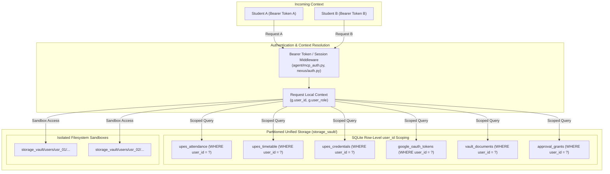

# Multi-Tenant Architecture Deep-Dive

> **Status**: VERIFIED CURRENT  
> **Scope**: Multi-tenant data partitioning, row-level security, isolated credential vaults, and per-user token scopes  
> **Last verified**: 2026-09-20 (Phase 4.2B Post-Rebase Audit)  
> **Evidence basis**: Verified source code in [`nexus/auth.py`](file:///e:/Workspace/Active/server/nexus/auth.py), [`agent/mcp_auth.py`](file:///e:/Workspace/Active/server/agent/mcp_auth.py), and test suite [`tests/test_multi_user_isolation.py`](file:///e:/Workspace/Active/server/tests/test_multi_user_isolation.py) (16/16 passed)

---

## 1. Multi-Tenant Philosophy & Model

NexusNode supports multiple concurrent academic users (e.g., student peers sharing a single appliance) while ensuring complete data isolation. The multi-tenant architecture enforces strict security boundaries across storage, credentials, API sessions, and external calendar synchronization.



---

## 2. Row-Level Database Isolation

All persistent user data is co-located in the single unified SQLite database ([`storage_vault/nexus_unified.db`](file:///e:/Workspace/Active/server/storage_vault/nexus_unified.db)), but every tenant-aware table includes a mandatory `user_id` foreign key:

| Table Name | Scoped Identifier | Isolation Enforced |
|---|---|---|
| `users` | `id` | Primary user identity & role (`student`, `admin`) |
| `upes_credentials` | `user_id` | Encrypted student portal credentials |
| `upes_attendance` | `user_id` | Subject attendance records |
| `upes_timetable` | `user_id` | Weekly class schedules |
| `calendar_sync_state` | `user_id` | Google Calendar event IDs and sync tokens |
| `google_oauth_tokens` | `user_id` | Per-user Google refresh and access tokens |
| `vault_documents` | `user_id` | Document metadata and storage file paths |
| `approval_grants` | `user_id` | Consequential action human approval tokens |
| `audit_logs` | `user_id` | Audit trail of tool invocations and logins |

### SQL Enforcement Pattern
Direct queries from application services or semantic MCP tools must supply the authenticated `user_id` as a binding parameter:
```python
cursor.execute(
    "SELECT * FROM upes_attendance WHERE user_id = ? AND subject_code = ?",
    (current_user_id, subject_code)
)
```
Cross-tenant updates, reads, or deletions are impossible without explicit administrative elevation.

---

## 3. Filesystem Isolation (Vault)

User files, syllabus documents, academic reports, and generated artifacts are kept in separate directories on disk:

```
storage_vault/
├── nexus_unified.db           # Unified database (WAL mode)
├── artifacts/                 # System-wide artifacts (benchmarks, public reports)
└── users/
    ├── usr_student_01/        # Isolated folder for Student 1
    │   ├── documents/
    │   ├── cache/
    │   └── temp/
    └── usr_student_02/        # Isolated folder for Student 2
        ├── documents/
        ├── cache/
        └── temp/
```

File path resolution validates that every file read or write is constrained within `storage_vault/users/{current_user_id}/`. Directory traversal attempts (`../`) are detected and rejected with `403 FORBIDDEN`.

---

## 4. Credential & OAuth Isolation

### A. Academic Portal Credentials
Each student's portal password and SAP ID are stored in `upes_credentials` encrypted using AES-GCM. The encryption key is derived from a server-level master key combined with a per-user salt. Student A cannot decrypt or access Student B's academic portal session.

### B. Shared Google OAuth with Per-User Tokens
NexusNode uses a single registered Google Cloud Client ID / Client Secret for the appliance (configured in `.env`), but OAuth tokens are authenticated per user:
- User initiates OAuth via `/api/calendar/connect`.
- Google returns an authorization code tied to the active web session.
- Tokens are exchanged and stored in `google_oauth_tokens` keyed to `user_id`.
- User A's classes are synced exclusively to User A's personal Google Calendar; User B's calendar is completely separate.

---

## 5. Automated Multi-Tenant Verification

The multi-tenant architecture is covered by [`tests/test_multi_user_isolation.py`](file:///e:/Workspace/Active/server/tests/test_multi_user_isolation.py) (16 tests, 100% passing). The suite programmatically verifies:
1. Student A cannot view or edit Student B's attendance records.
2. Student A cannot trigger Google Calendar sync against Student B's token.
3. Vault file read attempts across tenant boundaries throw security exceptions.
4. Consequential action approval tokens issued for Student A cannot be redeemed by Student B.
5. Administrative users (`role='admin'`) can inspect aggregate system statistics but cannot view raw student passwords.
