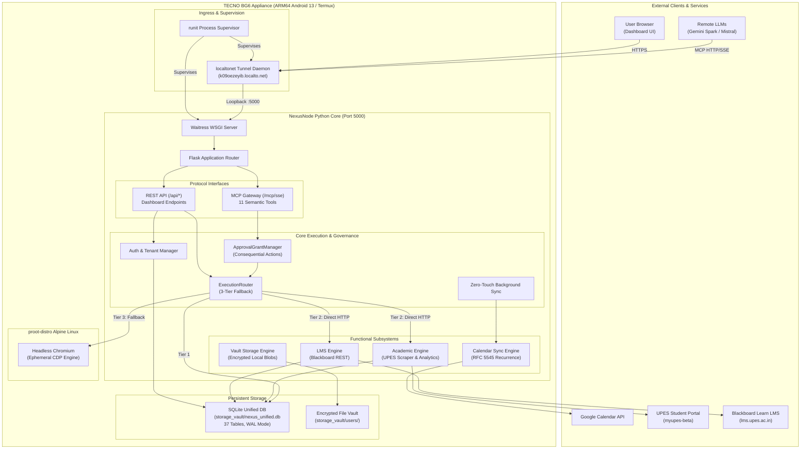

# System Architecture Deep-Dive

> **Status**: VERIFIED CURRENT  
> **Scope**: High-level system structure, deployment topology, and inter-component communication flows  
> **Last verified**: 2026-09-20 (Phase 4.2B Post-Rebase Audit)  
> **Evidence basis**: Verified production codebase, running service process tree on TECNO BG6, and network audit

---

## 1. High-Level Architecture Overview

NexusNode is an autonomous personal server appliance hosted entirely on a dedicated physical mobile device (**TECNO Spark Go 2024 / BG6**). It acts as an academic automation server, multi-tenant academic account gateway, Google Calendar reconciliation appliance, and private document Vault.

Instead of running local LLM weights on constrained device hardware, NexusNode interfaces with remote reasoning models (**Gemini Spark**, **Mistral**, etc.) via the standardized **Model Context Protocol (MCP)**. It exposes 11 high-level semantic tools that encapsulate complex academic and storage workflows.

---

## 2. Component Topology

### A. Physical Appliance (TECNO BG6)
- **Hardware**: Unisoc T606 SoC, 2x A75 + 6x A55 CPU cores, 3.77 GB RAM, 64 GB eMMC.
- **Environment**: Android 13 operating without root permissions.
- **Base Layer**: Termux environment providing native packages (`python 3.14.6`, `sqlite 3.46`, `runit`, `openssh`).
- **Isolation Container**: `proot-distro` Alpine Linux 3.20 providing glibc/musl compatibility and package management for native Chromium execution.

### B. Ingress and Networking
- **Port Binding**: NexusNode binds strictly to `127.0.0.1:5000` (Waitress).
- **Public Access**: Exclusively provided via `localtonet` reverse tunnel (`k09oezeyib.localto.net`). TLS is terminated at the tunnel edge.
- **Local Access**: Accessible via SSH on port `8022` within the local Wi-Fi subnet (`192.168.29.21`).

### C. Supervision Layer
The appliance uses the UNIX `runit` supervision tree under Termux:
- `runsv nexusnode`: Manages `app.py` under Python 3.14.6 with automated restart and output logging to `log/run`.
- `runsv localtonet`: Manages the tunnel client daemon to maintain public egress.

---

## 3. Communication & Execution Flows

### A. Semantic MCP Request Flow
1. Remote LLM (e.g., Gemini Spark) issues an MCP tool call (e.g., `academic.query`) over SSE/JSON-RPC.
2. Ingress terminates TLS and forwards the payload to `/mcp/sse` or `/mcp/messages`.
3. The request passes through `BearerTokenAuth` to identify the authenticated `user_id`.
4. If the action is consequential (modifying external portals or destroying state), `ApprovalGrantManager` checks for an active human grant token. If missing, it returns an `APPROVAL_REQUIRED` challenge.
5. The request enters `ExecutionRouter`, which checks local SQLite cache. If cache is fresh, data returns in <10 ms.
6. If cache is expired, Tier 2 executes direct authenticated HTTP queries against the UPES/LMS portal.
7. If the portal challenges with dynamic JavaScript or anti-bot verification, Tier 3 invokes ephemeral Chromium in `proot-distro` to resolve the challenge.
8. The result is normalized, updated in SQLite, and returned to the LLM formatted as an MCP response.

### B. First-Party Dashboard Flow
1. User loads `https://k09oezeyib.localto.net/` in their web browser.
2. The browser downloads the lightweight static assets (`index.html`, `app.js`, `index.css`).
3. Frontend authenticates using the session cookie or prompt-based password.
4. The dashboard requests dedicated REST endpoints:
   - `/api/system/status`: CPU, memory, uptime, and database stats.
   - `/api/academic/dashboard`: Aggregated attendance records, active courses, and upcoming timetable events.
   - `/api/admin/users`: Multi-tenant user management (admin only).
   - `/api/admin/approvals`: Pending consequential action grants.
5. REST endpoints execute directly against SQLite; they bypass LLM reasoning overhead and do not invoke MCP machinery.

---

## 4. Key Implementation Files

- [`app.py`](file:///e:/Workspace/Active/server/app.py): Main Flask application factory, route registration, and middleware initialization.
- [`agent/execution_router.py`](file:///e:/Workspace/Active/server/agent/execution_router.py): 3-tier fallback execution engine.
- [`agent/semantic_facade.py`](file:///e:/Workspace/Active/server/agent/semantic_facade.py): The 11 semantic MCP tool definitions and parameter schemas.
- [`agent/consequential.py`](file:///e:/Workspace/Active/server/agent/consequential.py): Cryptographic hash-based human approval grant verification.
- [`browser/chromium_runtime.py`](file:///e:/Workspace/Active/server/browser/chromium_runtime.py): Proot Chromium lifecycle orchestration.
- [`storage_vault/nexus_unified.db`](file:///e:/Workspace/Active/server/storage_vault/nexus_unified.db): Unified multi-tenant SQLite database.
