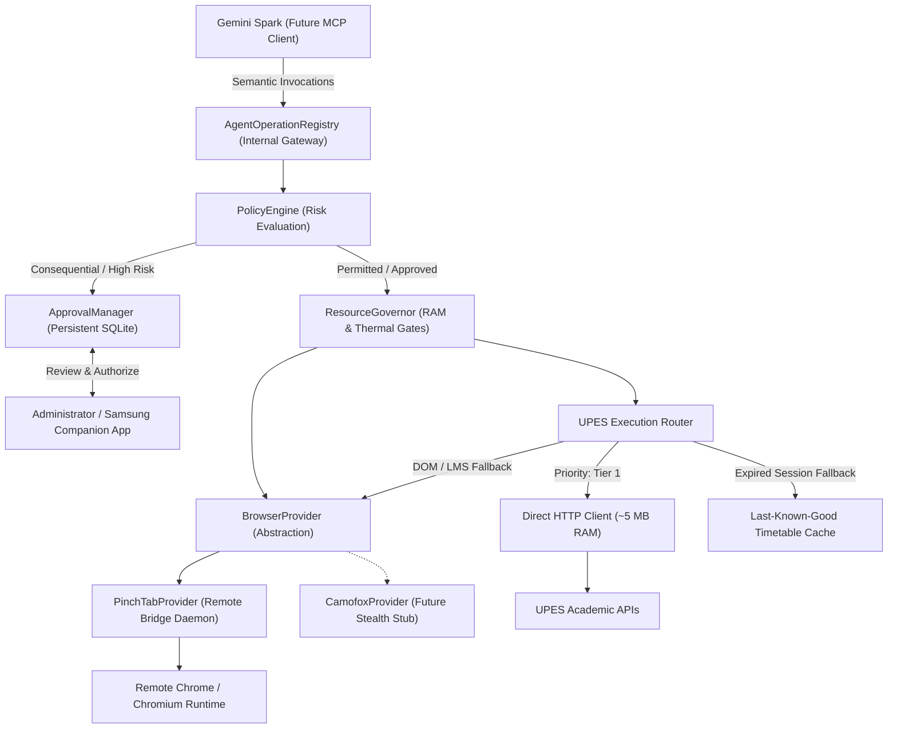
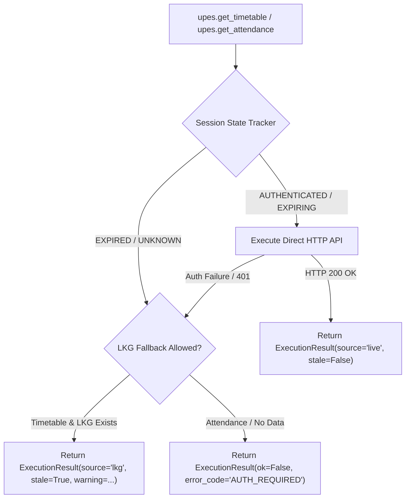
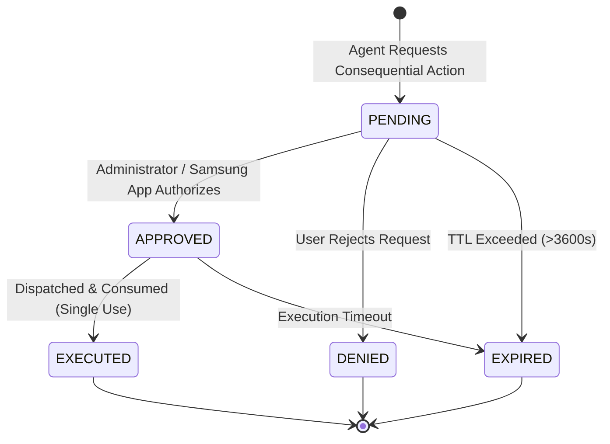

# NexusNode — Agent Execution Foundation, UPES Router & PinchTab Provider

This document defines the authoritative architecture, security boundaries, normalized interfaces, and execution models introduced in **Phase 3.1** of the NexusNode appliance.

---

## 1. Architectural Overview

Phase 3.1 establishes the execution foundation that will allow Gemini Spark to safely and autonomously operate NexusNode while strictly enforcing security, resource efficiency, and data integrity boundaries.



The core architectural principle of NexusNode is:
$$\mathbf{Semantic\ Operation\ First.\ Execution\ Mechanism\ Second.}$$

Code outside the execution layer (including the LLM agent) never needs to know whether an operation utilized direct HTTP, remote PinchTab, Last-Known-Good cache, or human companion interaction.

---

## 2. Module Architecture

The execution foundation is organized into three clean, decoupled packages:

```text
agent/
    __init__.py          # Package exports
    models.py            # ExecutionResult, WebContent, PendingApproval
    errors.py            # Structured typed exceptions and error codes
    policy.py            # RiskClass, ApprovalStatus, ApprovalManager, PolicyEngine
    registry.py          # AgentOperationRegistry dispatcher

browser/
    __init__.py          # Package exports
    base.py              # Abstract BrowserProvider, BrowserSession, BrowserSnapshot
    pinchtab.py          # PinchTabProvider HTTP client implementation
    camofox.py          # CamofoxProvider unregistered placeholder/stub

upes/
    __init__.py          # Package exports
    session.py           # UpesSessionTracker, UpesSessionState (Privacy Model)
    router.py            # UpesExecutionRouter (Direct HTTP priority + LKG fallback)
```

---

## 3. Normalized Execution Result & Provenance Model

Every semantic operation returns an authoritative `ExecutionResult` dataclass. The response explicitly declares data provenance and staleness to prevent stale cache data from being masqueraded as live:

```python
@dataclass
class ExecutionResult:
    ok: bool
    operation: str
    source: str                      # 'live' | 'lkg' | 'browser' | 'local'
    provider: str                    # 'direct_http' | 'pinchtab' | 'camofox' | 'lkg_cache' | 'local_vault'
    data: Any = None
    fetched_at: float = field(default_factory=time.time)
    stale: bool = False
    requires_approval: bool = False
    approval_id: Optional[str] = None
    error: Optional[str] = None
    error_code: Optional[str] = None
    metadata: Dict[str, Any] = field(default_factory=dict)
```

### Provenance Taxonomy

| Source | Provider | Meaning |
|:---|:---|:---|
| `live` | `direct_http` | Freshly fetched from upstream UPES APIs via HTTP within the active session. |
| `live` | `pinchtab` | Freshly observed or extracted from a live browser page DOM. |
| `lkg` | `lkg_cache` | Authoritative cache retrieved from SQLite when live upstream authentication is expired. |
| `local` | `direct_http` | Queried from local offline SQLite database summaries (e.g. course list). |
| `local` | `policy_engine` | Policy gate resolution or pending approval creation result. |

---

## 4. Typed Error Model

All system and operational failures are mapped to typed subclasses of `NexusAgentError`. Internal paths, credentials, and raw tracebacks are stripped before reaching clients:

```text
AUTH_REQUIRED              - UPES session missing or completely expired
SESSION_EXPIRED            - Active token expired and cannot be refreshed
INTERACTION_REQUIRED       - Student portal requires manual human input

BROWSER_UNAVAILABLE        - PinchTab daemon offline or disabled
BROWSER_CONNECTION_FAILED  - Network error or timeout communicating with browser
BROWSER_SESSION_FAILED     - Tab crashed or session allocation failed
NAVIGATION_FAILED          - Target URL unreachable or DNS resolution failure
ELEMENT_STALE              - Element reference (e.g. 'e1') no longer exists in DOM
UPLOAD_FAILED              - Failed to attach vault file to browser input
DOWNLOAD_FAILED            - Failed to intercept browser download
SECURITY_CHALLENGE         - Bot-detection, Cloudflare Turnstile, or CAPTCHA detected

RESOURCE_PRESSURE          - RAM or thermal thresholds violated (governor block)

APPROVAL_REQUIRED          - Operation is consequential and requires human approval
APPROVAL_DENIED            - Approval grant was rejected or invalidated
APPROVAL_EXPIRED           - Approval request exceeded TTL before execution

UPSTREAM_ERROR             - UPES server 500 error or portal maintenance
INTERNAL_ERROR             - Unhandled system exception
```

---

## 5. Generic BrowserProvider Interface

The generic abstraction in `browser/base.py` decouples the agent from specific automation drivers:

```python
class BrowserProvider(ABC):
    @property
    @abstractmethod
    def provider_name(self) -> str: pass
    
    @abstractmethod
    def get_health(self) -> Dict[str, Any]: pass
    
    @abstractmethod
    def create_session(self, session_id: str, profile_name: Optional[str] = None) -> BrowserSession: pass
    
    @abstractmethod
    def close_session(self, session_id: str) -> bool: pass
    
    @abstractmethod
    def navigate(self, session_id: str, url: str, wait_until: str = "load") -> Dict[str, Any]: pass
    
    @abstractmethod
    def snapshot(self, session_id: str, include_screenshot: bool = False) -> BrowserSnapshot: pass
    
    @abstractmethod
    def capture(self, session_id: str, full_page: bool = False) -> BrowserCapture: pass
    
    @abstractmethod
    def click(self, session_id: str, element_ref: str) -> Dict[str, Any]: pass
    
    @abstractmethod
    def type_text(self, session_id: str, element_ref: str, text: str, submit: bool = False) -> Dict[str, Any]: pass
    
    @abstractmethod
    def press(self, session_id: str, key: str) -> Dict[str, Any]: pass
    
    @abstractmethod
    def upload_file(self, session_id: str, element_ref: str, file_path: str) -> Dict[str, Any]: pass
    
    @abstractmethod
    def download_file(self, session_id: str, element_ref: str, target_dir: str) -> BrowserDownload: pass
    
    @abstractmethod
    def get_cookies(self, session_id: str, domain: Optional[str] = None) -> List[Dict[str, Any]]: pass
```

---

## 6. PinchTab Provider & Remote Browser Topology

`PinchTabProvider` operates as a lightweight HTTP client talking to a PinchTab daemon.

```text
+-------------------------------------------------------------+
|                     TECNO BG6 Appliance                     |
|                                                             |
|   NexusNode Core (Python)                                   |
|     |                                                       |
|     +---> PinchTabProvider (Lightweight HTTP Client)        |
|             (~0 MB additional process overhead)             |
+------------------------------+------------------------------+
                               |
                               | Authenticated Private Network
                               v
+-------------------------------------------------------------+
|                 Remote Worker / Windows Dev PC              |
|                                                             |
|   PinchTab Control Plane Daemon (:9867)                     |
|     |                                                       |
|     +---> Desktop Chromium / Chrome Instance                |
|             (Consumes ~600 MB - 1.2 GB RAM off-appliance)   |
+-------------------------------------------------------------+
```

### Configuration Variables (`config.py`)

| Setting | Environment Variable | Default | Purpose |
|:---|:---|:---|:---|
| `PINCHTAB_ENABLED` | `NEXUS_PINCHTAB_ENABLED` | `True` | Master toggle for agent browser integration. |
| `PINCHTAB_BASE_URL` | `NEXUS_PINCHTAB_URL` | `http://127.0.0.1:9867` | URL of the PinchTab control daemon. |
| `PINCHTAB_AUTH_TOKEN` | `NEXUS_PINCHTAB_TOKEN` | `None` | Optional Bearer authentication secret. |
| `PINCHTAB_TIMEOUT` | `NEXUS_PINCHTAB_TIMEOUT` | `15.0` | Socket and HTTP timeout seconds. |
| `BROWSER_REMOTE_MIN_RAM_MB` | `NEXUS_BROWSER_REMOTE_MIN_RAM_MB` | `100` | Minimum appliance RAM to permit remote browser control. |
| `BROWSER_LOCAL_MIN_RAM_MB` | `NEXUS_BROWSER_LOCAL_MIN_RAM_MB` | `800` | Minimum appliance RAM to permit local engine launch. |

---

## 7. UPES Execution Routing & LKG Provenance

`UpesExecutionRouter` (`upes/router.py`) handles all academic queries according to the following decision flow:



### Truthful Session State API (`/api/upes/session/status`)

The session state model never discloses tokens, refresh tokens, or secret keys:

```json
{
  "status": "success",
  "session": {
    "user_id": "admin",
    "configured": true,
    "state": "AUTHENTICATED",
    "student_code_masked": "5000***789",
    "token_expiry": 1756550000.0,
    "token_ttl_seconds": 6420,
    "cookie_expiry": 1756580000.0,
    "cookie_ttl_seconds": 36420,
    "has_refresh_token": true,
    "has_sso_cookies": true,
    "credential_generation": 1,
    "last_refresh_status": "SUCCESS",
    "is_live_ready": true
  }
}
```

---

## 8. Consequential Actions & Persistent Approval Lifecycle

Operations that make permanent or external mutations are classified under `RiskClass.CONSEQUENTIAL` and cannot execute without a cryptographically recorded approval grant.

### Risk Class Hierarchy

* **`READ_ONLY`**: `upes.get_attendance`, `upes.get_timetable`, `upes.get_courses`, `browser.snapshot`, `browser.navigate`, `vault.read`, `vault.search`. Executed immediately.
* **`WRITE_LOW_RISK`**: `vault.write`, `browser.click`, `browser.type`, `upes.download_resource`. Executed immediately under standard governor limits.
* **`CONSEQUENTIAL`**: `upes.submit_assignment`, `portal.delete`, `portal.message_send`, `portal.payment`. Mandates `ApprovalManager` intervention.

### Approval State Machine



### Anti-Tampering Protections

1. **Anti-Replay / Single-Use Guarantee**: Once an action transitions from `APPROVED` to `EXECUTED`, the approval ID is spent and cannot be reused for a second execution.
2. **Immutable Operation Binding**: An approval created for `upes.submit_assignment` cannot be used to execute `portal.delete`.
3. **No Self-Authorization**: The agent context has zero capability to approve its own requests. Approvals require an explicit HTTP POST to `/api/approvals/<id>/approve` with admin session privileges.

---

## 9. Prompt-Injection Safety Boundary

Remote web content processed by `BrowserSnapshot` is explicitly isolated:

1. **Encapsulation**: Content is serialized inside `<untrusted_web_content origin="..." timestamp="...">` envelopes.
2. **Structural Firewall**: Text found within webpage content is strictly treated as passive data. The server engine never evaluates strings from web responses as tool calls, policy mutations, or approval grants.
3. **Immutable Policy**: Policy rules and risk mappings are compiled Python constants that cannot be rewritten by agent context or web scrape inputs.

---

## 10. Verification & Test Coverage

The test suite contains **413 total passing unit and integration tests** (`tests/test_agent_execution_foundation.py` and `tests/test_agent_api.py`).

| Test Number | Validation Criterion | Test Method | Result |
|:---|:---|:---|:---:|
| 1 | Normalized Execution Result | `test_01_normalized_execution_result` | **PASS** |
| 2 | Normalized Error Hierarchy | `test_02_normalized_errors` | **PASS** |
| 3 | BrowserProvider Contract | `test_03_browser_provider_contract` | **PASS** |
| 4 | PinchTab Connection Failure | `test_04_pinchtab_connection_failure` | **PASS** |
| 5 | PinchTab Timeout | `test_05_pinchtab_timeout` | **PASS** |
| 6 | PinchTab Invalid Response / Challenge | `test_06_pinchtab_invalid_response` | **PASS** |
| 7 | PinchTab Stale Ref Normalization | `test_07_pinchtab_stale_ref_normalization` | **PASS** |
| 8 | Browser Governor Remote Mode | `test_08_browser_governor_remote_mode` | **PASS** |
| 9 | Browser Governor Critical RAM Rejection | `test_09_browser_governor_critical_memory_rejection` | **PASS** |
| 10 | UPES Attendance Direct HTTP Priority | `test_10_upes_attendance_routes_to_direct_http` | **PASS** |
| 11 | UPES Timetable LIVE Provenance | `test_11_upes_timetable_returns_live_provenance` | **PASS** |
| 12 | UPES Timetable LKG Stale Provenance | `test_12_upes_timetable_lkg_fallback_returns_stale_provenance` | **PASS** |
| 13 | Expired Session Never Reports Authenticated | `test_13_expired_session_never_reports_authenticated_due_to_lkg` | **PASS** |
| 14 | Session State API Hides Tokens | `test_14_session_state_api_hides_tokens` | **PASS** |
| 15 | Approval Request Creation | `test_15_approval_creation` | **PASS** |
| 16 | Approval RBAC Checks | `test_16_approval_rbac` | **PASS** |
| 17 | Approval Expiration | `test_17_approval_expiration` | **PASS** |
| 18 | Approval Replay Rejection | `test_18_approval_replay_rejection` | **PASS** |
| 19 | Immutable Approval Payload | `test_19_immutable_approval_payload` | **PASS** |
| 20 | Consequential Action Blocked | `test_20_consequential_action_blocked_without_approval` | **PASS** |
| 21 | Approved Action Single-Use | `test_21_approved_action_executes_at_most_once` | **PASS** |
| 22 | Web Content Cannot Approve Actions | `test_22_webpage_content_cannot_approve_action` | **PASS** |
| 23 | Web Content Cannot Mutate Policy | `test_23_webpage_content_cannot_mutate_policy` | **PASS** |
| 24 | Operation Registry Routing | `test_24_internal_operation_registry_routing` | **PASS** |
| 25 | Browser Endpoint Hides Credentials | `test_25_browser_endpoint_does_not_expose_credentials` | **PASS** |

---

## 11. Future Roadmap Connections

* **Phase 3.2 (Automated UPES Credential Management)**: Add `UPESCredentialProvider` and `UPESAuthManager` to automate headless refresh and periodic session renewal directly over HTTP without modifying the router contract.
* **Phase 3.3 (MCP Server Adapter for Gemini Spark)**: Expose `AgentOperationRegistry` over standard JSON-RPC MCP tools (`nexus_upes_get_attendance`, `nexus_browser_navigate`, `nexus_approvals_list`).
* **Phase 3.4 (Camofox Stealth Node)**: Implement `CamofoxProvider` for automated escalation when Cloudflare Turnstile blocks standard browser workers.
* **Phase 3.5 (Samsung Android Companion App)**: Connect the native Android app via SSE to stream real-time approval requests and allow one-tap cryptographic authorization of consequential actions.
