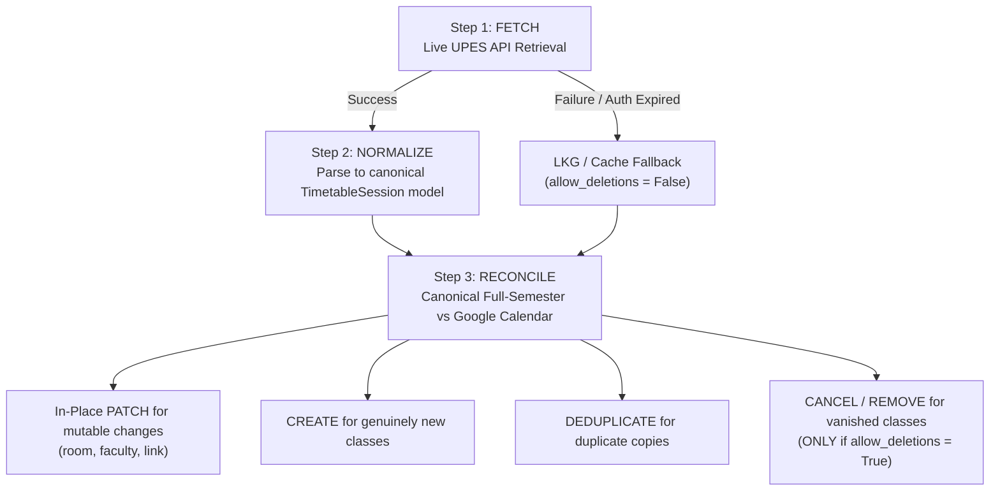

# NexusNode — Google Calendar Full-Semester Continuous Reconciliation Architecture

## 1. Overview & Policy Definition

NexusNode operates under a **Full-Semester Continuous Reconciliation** policy:
- **Policy**: `FULL_SEMESTER` (Google Calendar maintains the complete active academic semester timetable, e.g. 384 sessions spanning August to December).
- **Synchronization Cadence**: **Every 3 Hours** via `SchedulerDaemon` (`job_timetable_sync`, interval = `10800` seconds).
- **Architecture Principle**: **Scope $\neq$ Cadence**. Full-semester population is continuously refreshed, not statically populated.

---

## 2. 3-Hour Continuous Synchronization Pipeline

Every 3 hours, the scheduler executes a 3-step pipeline:

---

## 3. LKG & Offline Deletion Safety Guard

> [!CAUTION]
> **Mandatory Safety Rule**: Destructive deletions on Google Calendar are strictly gated by `allow_deletions = True`.
> If the live UPES fetch fails (network timeout, portal maintenance, expired OAuth session) and NexusNode falls back to LKG (Last-Known-Good) cache, `allow_deletions` is set to **`False`**.
>
> In LKG/stale mode, the synchronizer performs NOOPs and safe in-place updates, but **ZERO cancellation deletions are permitted**. This prevents transient network or authentication outages from erasing valid student schedules.

---

## 4. Class Life-Cycle Reconciliation Behavior

| Event Scenario | Authoritative Trigger | Calendar Reconciliation Action |
| :--- | :--- | :--- |
| **No Changes** | Unchanged 384 sessions | **100% NO-OP** (0 creates, 0 updates, 0 deletes). |
| **Room Change** | e.g. `Room 11013` $\rightarrow$ `Room 11215` | **In-Place PATCH** on existing Google event (preserves Google Event ID & user reminders). |
| **Faculty Change** | e.g. `Dr. A` $\rightarrow$ `Dr. B` | **In-Place PATCH** on existing Google event. |
| **Class Rescheduled** | Same course, new date/time | **In-Place MOVE / PATCH** if identifiable, otherwise delete old + create new. |
| **Class Cancelled** | Live UPES fetch confirms removal | **Delete Managed Event** (only when `allow_deletions = True`). |
| **New Class Added** | UPES timetable gains session | **Create Event** with `cslot_v1` extended properties. |
| **UPES Auth Expired** | Refresh rejected / 401 | **Preserve Calendar Intact** (`allow_deletions = False`), record telemetry. |

---

## 5. Field Ownership & PATCH Semantics

- **NexusNode-Owned Fields**: `summary` (`[CODE] Course Name`), `location` (`Room`), `description` (`Faculty: ...\nManaged by: NexusNode\nSlotKey: cslot_...`), `start`, `end`, `extendedProperties.private`.
- **User-Preserved Fields**: User reminders (`reminders`), event color (`colorId`), and manual user attendees/notes.
- **Identity Invariant**: `cslot_v1` remains stable across room and faculty changes, preventing duplicate event creation.
