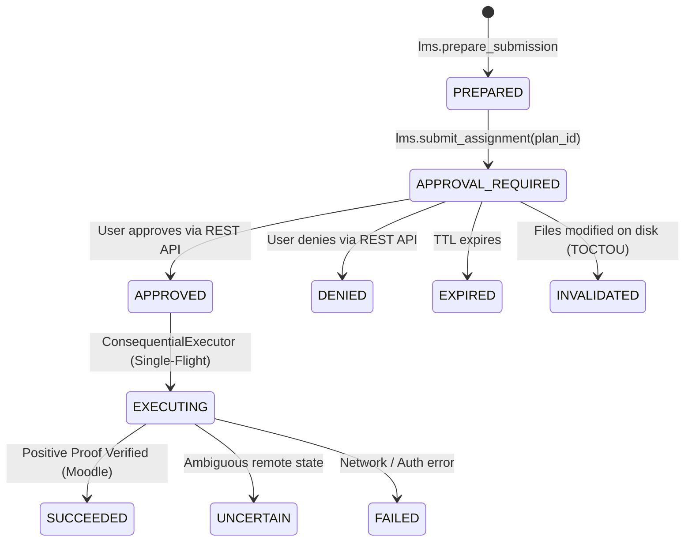

# NexusNode Consequential Action Architecture

## Overview
A **consequential action** in NexusNode is any state-altering operation that cannot be safely undone without human oversight (e.g. submitting academic coursework to Moodle, making irreversible grading edits, or deleting cloud resources).

Under the Phase 3.6A architecture:
1. **Gemini Spark only requests** consequential actions via semantic MCP tools (e.g. `lms.submit_assignment(submission_plan_id)`).
2. **NexusNode pauses execution** and creates a server-side `ConsequentialAction` and an `ApprovalRequest`.
3. **NexusNode returns `APPROVAL_REQUIRED`** to Gemini Spark alongside safe structured summary metadata and expiration timestamps. Gemini Spark is **never** provided secret tokens, signatures, or execution capabilities.
4. **Human / Samsung Companion authorizes** the action through authenticated REST endpoints (`POST /api/approvals/<id>/approve` or `POST /api/approvals/<id>/deny`).
5. **NexusNode consumes a single-use `ApprovalGrant`** internally using domain-separated cryptography (`nexusnode/approval/v1`), re-verifies file hashes (TOCTOU protection), performs remote target verification, executes the action, and captures post-execution proof.

---

## State Machine

---

## Cryptographic Domain Separation

Approval grants are authenticated via HMAC-SHA256 with key derivation isolated from credential or session storage:
- **HKDF Info**: `b"nexusnode/approval/v1"`
- **HKDF Salt**: `b"nexusnode_approval_v1_salt"`
- **Digest**: `v1|grant_id|approval_id|action_id|operation|user_id|parameters_hash|created_at|expires_at|nonce`

---

## TOCTOU Protection & Single-Flight Execution
1. **SubmissionPlan Freeze**: When a draft plan is prepared, all Vault files are recorded with size and SHA-256 digests.
2. **Re-validation Immediately Before Submission**: The executor reads all Vault files from disk and recomputes SHA-256 hashes. If any file was modified, the action is marked `INVALIDATED` and zero submission occurs.
3. **Single-Use Authority**: The `ApprovalGrant` is atomically marked `is_consumed = 1` within an SQLite transaction upon first execution attempt.
4. **Single-Flight Lock**: An in-memory thread lock prevents concurrent execution of the same action ID.
5. **Crash Recovery**: If the server crashes during execution, the executor inspects remote Moodle state upon retry. If the submission is already present, it transitions to `SUCCEEDED` without double-submitting.
