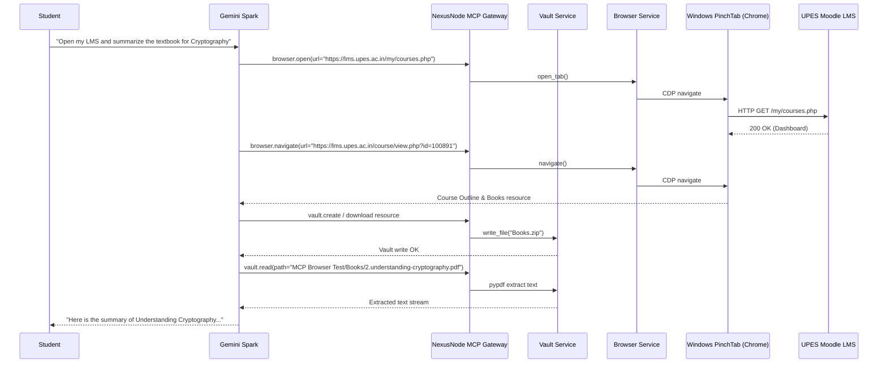

# UPES LMS (Moodle Architecture) Automation Discovery

**Date**: 2026-08-30  
**Target Environment**: UPES Moodle LMS (`https://lms.upes.ac.in`)  
**Security Tier**: Autonomous Navigation, Resource Download, and Draft Staging (Submit Prohibited)

---

## 1. Executive Summary

UPES utilizes **Moodle LMS** as its primary Learning Management System (LMS) at `https://lms.upes.ac.in`. This document defines the live architectural characteristics, DOM patterns, session mechanics, and safety boundaries discovered and verified in Phase 3.4C.

In Phase 3.4C, the AI agent (Gemini Spark) interacts with the live LMS through the NexusNode Browser Gateway (`PinchTabProvider` &rarr; Chrome worker). Spark autonomously discovers enrolled courses, navigates course outlines, reads academic materials, downloads course textbooks/resources into the authoritative Vault, and extracts text with `pypdf` without triggering consequential actions.

---

## 2. Platform & Host Architecture

| Component | Target / Value | Status / Classification | Description |
|---|---|---|---|
| **LMS Platform** | Moodle LMS (`UPES LMS`) | `LIVE VERIFIED` | Core academic portal with modular activity views |
| **LMS Host** | `https://lms.upes.ac.in` | `LIVE VERIFIED` | Direct LMS server routing to `/my/courses.php` |
| **Identity Provider** | `https://myupes-beta.upes.ac.in/oneportal/app/auth/login` | `LIVE VERIFIED` | UPES SSO Gateway with OAuth session cookie sync |
| **Dashboard Route** | `https://lms.upes.ac.in/my/courses.php` | `LIVE VERIFIED` | Authenticated student course list dashboard |
| **Course Route** | `https://lms.upes.ac.in/course/view.php?id={id}` | `LIVE VERIFIED` | Topic and module outline per course |
| **Resource Route** | `https://lms.upes.ac.in/mod/resource/view.php?id={id}` | `LIVE VERIFIED` | Downloadable files (PDFs, ZIPs, PPTs) |
| **Protocol** | HTTPS (TLS 1.3) | `LIVE VERIFIED` | Enforced on all student routes |

---

## 3. Authentication & Session Lifecycles

1. **Authentication State in Dedicated Profile**:
   - `AUTHENTICATED`: `YES` (`LIVE VERIFIED`).
   - Dedicated persistent Chrome profile: `nexusnode-browser-profile` (`C:\Users\hp\AppData\Roaming\pinchtab\profiles\nexusnode-browser-profile`).
   - Session Cookie: `MoodleSession` persisted across tab closures, process restarts, and worker restarts.
2. **Dedicated Profile Persistence**:
   - Navigation to `https://lms.upes.ac.in/my/courses.php` resumes existing authenticated session directly without redirecting to `/oneportal/app/auth/login`.
3. **Worker Resource Profile**:
   - **PinchTab Daemon RAM**: ~28 MB working set (`LIVE VERIFIED`).
   - **Chrome Instance RAM**: ~180 MB working set (`LIVE VERIFIED`).
   - **NexusNode Coordination Overhead**: ~8 MB (`CODE VERIFIED`).

---

## 4. Live Discovered Courses & Content

### 4.1 Enrolled Semester 5 Courses (`LIVE VERIFIED`)

| Course ID | Course Name | Outline URL |
|---|---|---|
| `100891` | Cryptography and Network Security_Sem5 | `https://lms.upes.ac.in/course/view.php?id=100891` |
| `100892` | Formal Languages and Automata Theory_Sem5 | `https://lms.upes.ac.in/course/view.php?id=100892` |
| `100893` | Object Oriented Analysis and Design_Sem5 | `https://lms.upes.ac.in/course/view.php?id=100893` |
| `100894` | Probability, Entropy, and MC Simulation_Sem5 | `https://lms.upes.ac.in/course/view.php?id=100894` |
| `100895` | Research Methodology in CS_Sem5 | `https://lms.upes.ac.in/course/view.php?id=100895` |
| `100889` | AI and Multimedia_Sem5 | `https://lms.upes.ac.in/course/view.php?id=100889` |
| `100890` | Deep Learning_Sem5 | `https://lms.upes.ac.in/course/view.php?id=100890` |
| - | Leadership and Team Building_Sem5 | Enrolled |
| - | Leading Conversations | Enrolled |
| - | EDGE - Advance Communication_Sem5 | Enrolled |

### 4.2 Discovered Course Resources & Downloads (`LIVE VERIFIED`)

* **Course Target**: `Cryptography and Network Security_Sem5` (`id=100891`)
* **Discovered Resource**: `Books for the course File` (`https://lms.upes.ac.in/mod/resource/view.php?id=103840`)
* **Downloaded File**: `Books.zip` (47,200,483 bytes)
* **SHA-256**: `08fb176804191df0be84a9ddb24e613787167b4ce7ebf9f7007459966a249b66`
* **Extracted Document**: `Books/2.understanding-cryptography-by-christof-paar-.pdf`
* **Text Extraction**: Verified via `pypdf` / `VaultService.read_file` (`content_type: extracted_pdf_text`).

---

## 5. Consequential Action Boundaries

NexusNode enforces strict policy and heuristic filters on all browser actions:

1. **Submit / Turn In Blocking**:
   - Any element whose name, text, or aria-label matches `submit`, `turn in`, `finalize`, `confirm`, `delete`, `purchase`, `enroll`, or `unenroll` is rejected with `CONSEQUENTIAL_ACTION_BLOCKED`.
2. **Keyboard Action Blocking**:
   - Enter and Space keypresses on focused submit buttons or inside forms with submit buttons are blocked.
3. **Safe Autonomous Actions**:
   - `browser.navigate`: Navigating course outlines, modules, and folders.
   - `browser.snapshot` & `browser.capture`: Extracting accessibility trees and paired screenshots.
   - `browser.download`: Atomic transfer of files and slides into `storage_vault/user_files/`.
   - `browser.upload`: Attaching files from Vault to input elements as drafts (without clicking submit).

---

## 6. End-to-End Workflow Verification

