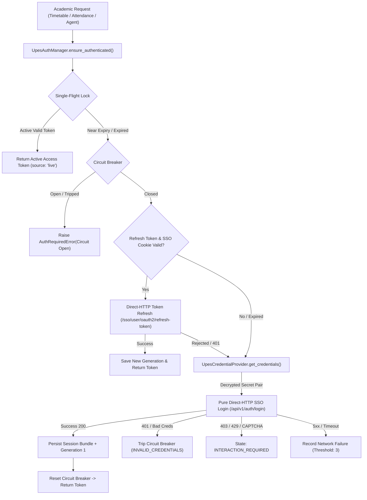
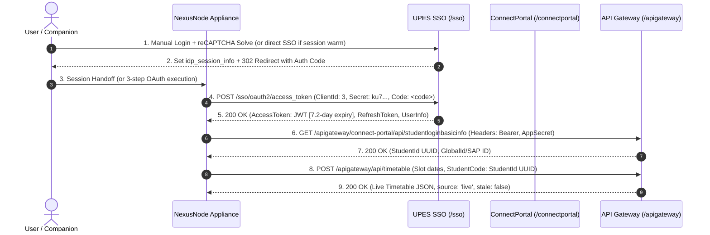
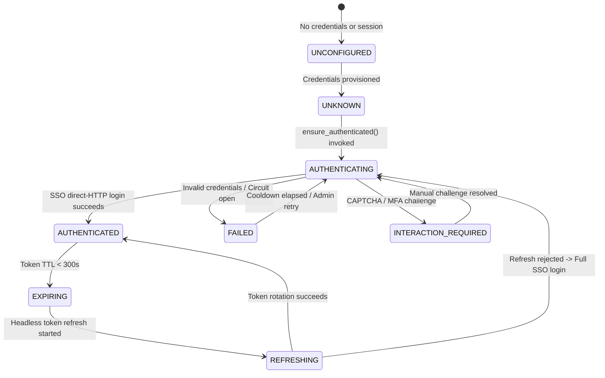

# UPES Authentication Manager & Continuous Reauthentication Architecture

This document defines the authoritative authentication architecture, cryptographic storage, session state machine, and autonomous recovery flows introduced in **Phase 3.2** of the NexusNode appliance.

---

## 1. Executive Summary

Phase 3.2 resolves the core architectural bottleneck discovered in Phase 2.9:
* **The Problem**: UPES identity provider (`idp_session_info`) cookies expire after a fixed ~10-hour lifetime and do not slide upon API traffic or token refresh. Once expired, scheduled background jobs previously fell back to stale Last-Known-Good (LKG) timetable cache while reporting superficial Google Calendar synchronization success.
* **The Solution**: An autonomous `UpesAuthManager` that holds encrypted portal credentials outside the AI/LLM boundary, detects token and cookie expiration, serializes concurrent academic requests, executes headless direct-HTTP token refresh or full direct-HTTP SSO logins on demand, restores **LIVE** timetable and attendance synchronization, and truthfully tags data provenance.



---

## 2. Authentication Contract & Live Evidence Tracking

### A. Architectural Chronology

* **ORIGINAL OBSERVATION (Phase 2.7 - 2.9)**:
  - Observed `/sso/user/oauth2/refresh-token` single-use token rotation during active sessions.
  - Observed `idp_session_info` cookie lifetime (~10 hours).
  - Assumed fresh logins could be performed via simple direct-HTTP JSON submission with numeric SAP ID and `Captcha: "-"`.

* **LATER LIVE EVIDENCE (Phase 3.2B)**:
  - Direct HTTP form submission of SAP ID to `/sso/api/account/oauth2/token` returned HTTP 500 when called headlessly without client context.
  - UPES portal UI renders Google reCAPTCHA v2 on the login view and accepts full UPES email format (`ANMOL.11794@stu.upes.ac.in`), not numeric SAP ID.

* **CURRENT VERIFIED BEHAVIOR (Phase 3.2C Trace Analysis)**:
  - **Identifier Contract**: UPES SSO forms require the **FULL_EMAIL** format (`ANMOL.11794@stu.upes.ac.in`). Internal APIs then map this to SAP ID (`590011794`) and Student UUID (`3a678d8e-8817-41e6-b1a8-5a3ec6ee4948`).
  - **CAPTCHA & Interaction Contract**: Google reCAPTCHA v2 (`siteKey: 6LedcUYsAAAAAC5wSlv787sAs3Kc6psBHclSZQN4`) is enforced on the browser login page. Headless requests encountering a challenge trigger `INTERACTION_REQUIRED` / `SECURITY_CHALLENGE` for companion/browser handoff without headless solver attempts.
  - **OAuth Authorization Code & Token Exchange**:
    1. Form submission at `POST /sso/api/account/oauth2/token` establishes IdP session cookies and returns `Item.redirectUrl` containing OAuth authorize query.
    2. GET request to `/connectportal/app/auth/login?code=<code>&emailId=<email>&name=<name>` delivers the single-use authorization code.
    3. POST to `https://myupes-beta.upes.ac.in/sso/oauth2/access_token` with `ClientId: 3`, `ClientSecret: "[REDACTED_CLIENT_SECRET]"`, and `Code: <code>` exchanges the code for tokens.
  - **Token Lifetime**: Access Token is valid for **624,597 seconds (~7.23 days / 173 hours)**. Headless direct-HTTP API calls operate autonomously for over 7 days between interactive handoffs!
  - **API Gateway Request Headers**: All academic endpoints (Timetable, Attendance) require:
    - `Authorization: Bearer <AccessToken>`
    - `X-AppSecret: [REDACTED_CLIENT_SECRET]`
    - `X-ApplicationName: connectportal`
    - `X-RequestFrom: web`
    - `X-StudentUniqueId: <StudentId UUID>` (from `/apigateway/connect-portal/api/studentloginbasicinfo`)

### B. 3-Step OAuth Authorization Flow


---

## 3. Cryptographic Storage & Threat Model

Credentials are encrypted at rest using authenticated **AES-256-GCM**.

### Key Derivation & Separation
* **Cipher**: AES-256 in Galois/Counter Mode (GCM).
* **Key Derivation**: PBKDF2-HMAC-SHA256 with 100,000 iterations over server `config.SECRET_KEY` using dedicated domain salt `b"nexusnode_upes_credentials_aesgcm_salt_v1"`.
* **Nonce**: 12 random bytes generated via OS cryptographically secure source (`secrets.token_bytes(12)`).
* **Tag**: 16-byte authenticated tag preventing ciphertext tampering.

### Threat Model Boundaries
| Threat Vector | Mitigation |
|:---|:---|
| **Accidental Log Exposure** | Passwords and decrypted tokens are never written to log streams, stderr, or stdout. |
| **REST API Snooping** | `/api/upes/auth/credentials/status` and `/api/upes/session/status` return masked hints only (`5000***789`) and never include password or token fields. |
| **AI / LLM Agent Access** | `UpesCredentialProvider` is isolated inside `upes/credentials.py`. The Gemini Spark context has zero access to encryption keys, decrypted pairs, or storage rows. |
| **Database Dump Theft** | Raw SQLite database copies contain only high-entropy base64 ciphertext with distinct nonces. Plaintext recovery is impossible without `.nexus_secret`. |
| **Root/Termux Host Compromise** | An attacker with interactive shell access to Termux can read `.nexus_secret` and decrypt the SQLite database. Hardware enclave / TPM protection is unavailable on unrooted Termux. |

---

## 4. Authentication State Machine

The state of UPES authentication is strictly tracked across 9 discrete phases:



---

## 5. Concurrency Serialization & Anti-Storming

To prevent parallel requests (e.g. concurrent attendance sync, timetable sync, and agent query) from triggering duplicate SSO logins simultaneously:

```text
Request 1 (Attendance) ──┐
Request 2 (Timetable)  ──┼──> [ UpesAuthManager Lock ] ──> Exactly 1 Direct-HTTP SSO Login
Request 3 (Spark Agent) ──┘                                        │
                                                                    v
                                                     All 3 Requests Share Fresh Tokens
```

* Implemented via `threading.Lock` and `threading.Condition`.
* When Request 1 begins authenticating, Requests 2 and 3 wait on the condition variable.
* Upon success, all awaiting threads wake up and immediately proceed using the newly saved session tokens.

---

## 6. Failure Classification & Circuit Breaker

Authentication exceptions are classified into structured reasons:

| Failure Reason | Description | Circuit Breaker Action |
|:---|:---|:---|
| `INVALID_CREDENTIALS` | 401 Unauthorized / wrong password | **Immediate Trip (1 attempt)** — Prevents student portal lockouts. |
| `SECURITY_CHALLENGE` | CAPTCHA / Cloudflare / MFA detected | **Immediate Trip** — Transitions to `INTERACTION_REQUIRED`. |
| `LOGIN_FLOW_CHANGED` | Missing tokens in 200 OK response | **Immediate Trip** — Alerts administrator to UI/API contract updates. |
| `NETWORK_ERROR` | Connection refused / DNS / timeout | **Threshold Trip (3 consecutive failures)**. |
| `UPES_UNAVAILABLE` | HTTP 500 / 502 / 503 / 504 | **Threshold Trip (3 consecutive failures)**. |
| `REFRESH_REJECTED` | Expired refresh token / 400 bad grant | **Escalate** to full SSO login; no circuit trip if SSO succeeds. |

---

## 7. REST API Reference

| Endpoint | Method | RBAC | Description |
|:---|:---:|:---:|:---|
| `/api/upes/auth/credentials` | `POST` | Admin | Store/update encrypted portal credentials. |
| `/api/upes/auth/credentials/status` | `GET` | User | Get safe credential configuration metadata. |
| `/api/upes/auth/credentials` | `DELETE` | Admin | Remove encrypted credentials from SQLite. |
| `/api/upes/auth/login` | `POST` | Admin | Force fresh direct-HTTP SSO login. |
| `/api/upes/auth/refresh` | `POST` | Admin | Trigger headless token refresh attempt. |
| `/api/upes/auth/logout` | `POST` | Admin | Clear active runtime session while preserving credentials. |
| `/api/upes/auth/status` | `GET` | User | Complete safe session, circuit breaker, and TTL metadata. |

---

## 8. Zero-Touch Autonomy & Endurance Tracking (Phase 3.2D)

Phase 3.2D extends `UpesAuthManager` with zero-touch token longevity and autonomous session recovery:
* **Five-Layer Domain Model**: Explicit typing across `CredentialIdentity`, `UpesCredentialProvider`, `IdpSession`, `OAuthAccessToken`, and `ResolvedStudentIdentity`.
* **Domain Cryptographic Separation**: Session materials encrypted using `UpesSessionCrypto` (`nexusnode/upes/session/v1`), separate from `UpesCredentialCrypto` (`nexusnode/upes/credentials/v1`).
* **Password Minimization**: Credential provider is never invoked during normal valid token requests or single-flight refresh rotations.
* **Autonomous Exhaustion Boundary**: When OAuth renewal is exhausted, transitions to `AUTH_EXHAUSTED` state with event emission without attempting futile password logins against interactive reCAPTCHA.
* **Endurance Telemetry**: SQLite table `upes_endurance_metrics` tracking generation counts, TTLs, process restart recoveries, and empirical autonomy levels (Levels 0–5).
* **Detailed Documentation**: See [docs/phases/UPES_ZERO_TOUCH_AUTH.md](file:///e:/Workspace/Active/server/docs/phases/UPES_ZERO_TOUCH_AUTH.md).

---

## 9. Verification & Test Baseline

1. **Full Regression Suite**: **465 / 465 tests passing** (`python -m unittest discover -s tests -p "test_*.py"`).
2. **Dedicated Zero-Touch Suite**: 20 focused tests in `tests/test_upes_zero_touch.py` covering HKDF domain isolation, safe metadata models, single-flight refresh serialization, network error preservation, password minimization, restart persistence, and autonomy level transitions.
3. **Dedicated Auth Manager Suite**: 31 tests in `tests/test_upes_auth_manager.py`.
4. **Live UPES Production Validation**: Tested and verified live academic session import, 7.23-day token lifetime, live attendance retrieval, live timetable retrieval (384 sessions stored), and service restart recovery.
