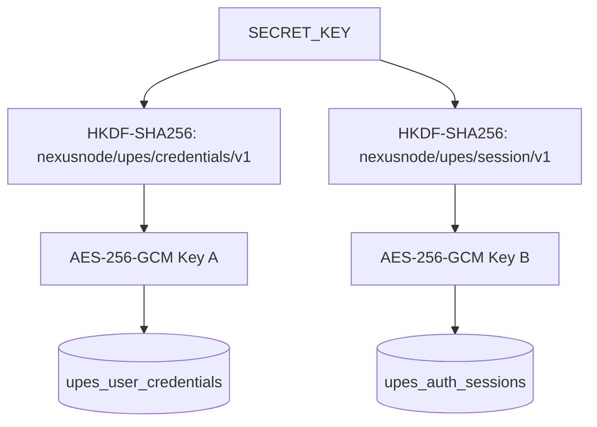

# UPES Zero-Touch Authentication, Token Longevity & Autonomous Session Recovery (Phase 3.2D)

## 1. Executive Summary & Product Objective

The primary requirement for NexusNode UPES integration is **zero-touch autonomous operation**. The mobile server appliance running on the host device (TECNO BG6, Android 13, Termux, direct-HTTP execution) must maintain and recover valid authentication with the official UPES Connect Portal services with zero user friction under normal continuous operation.

Phase 3.2D establishes:
1. **Five-Layer Authentication Domain Model** separating non-sensitive identity metadata, encrypted credential secrets, IdP SSO cookies, OAuth session tokens, and resolved student academic identity.
2. **Domain-Separated Cryptography** isolating credential secrets (`nexusnode/upes/credentials/v1`) from session tokens (`nexusnode/upes/session/v1`).
3. **Password Minimization Guarantee** ensuring encrypted portal passwords are never decrypted during active OAuth token usage or token refresh.
4. **Interactive Security Boundary (`AUTH_EXHAUSTED`)** ensuring that when autonomous OAuth renewal is legitimately exhausted, the system transitions to an explicit exhausted state rather than futilely retrying password logins against interactive reCAPTCHA.
5. **Zero-Touch Endurance Telemetry** tracking generation longevity, single-flight refresh rotations, process restart recoveries, and empirical autonomy levels (Levels 0–5) with zero secret exposure.

---

## 2. Five-Layer Authentication Architecture

```
+-------------------------------------------------------------------------+
| Layer 1: Credential Identity (Safe Metadata)                            |
| configured_format: NUMERIC_SAP_ID | expected_format: FULL_EMAIL | mismatch: true |
+-------------------------------------------------------------------------+
                                    | (Explicit bootstrap only)
+-------------------------------------------------------------------------+
| Layer 2: Credential Secret Provider (Encrypted at Rest)                 |
| Domain: nexusnode/upes/credentials/v1 (AES-256-GCM)                     |
| Invocations: 0 during normal token usage or refresh                     |
+-------------------------------------------------------------------------+
                                    |
+-------------------------------------------------------------------------+
| Layer 3: IdP SSO Session (Cookies)                                      |
| idp_session_info (10h max-age), idp_remember_session                     |
+-------------------------------------------------------------------------+
                                    |
+-------------------------------------------------------------------------+
| Layer 4: OAuth Session (Access & Refresh Tokens)                        |
| Access Token: JWT Bearer (~7.23 days / 624,597s validity)               |
| Refresh Token: Rotatable token submitted to SSO refresh endpoint        |
| Domain: nexusnode/upes/session/v1 (AES-256-GCM)                         |
+-------------------------------------------------------------------------+
                                    |
+-------------------------------------------------------------------------+
| Layer 5: Resolved Student Academic Identity                             |
| StudentId: UUID (3a678d8e-8817-41e6-b1a8-5a3ec6ee4948)                 |
| GlobalId: SAP ID (590011794) | UserId: 30054 | EmailId: ...@stu.upes.ac.in |
+-------------------------------------------------------------------------+
```

### Layer Details

* **Layer 1 (Credential Identity)**:
  - Modeled by `upes.models.CredentialIdentity`.
  - Exposes `configured_format` (`FULL_EMAIL` / `NUMERIC_SAP_ID` / `UNKNOWN`), `username_hint` (e.g., `ANM***@stu.upes.ac.in` or `5900***794`), `expected_format` (`FULL_EMAIL`), and `mismatch` (`bool`).
  - Contains **zero secret fields**. Safe for status APIs, CLI, and logs.

* **Layer 2 (Credential Secret Provider)**:
  - Managed by `upes.credentials.UpesCredentialProvider`.
  - Protected at rest with `UpesCredentialCrypto` using HKDF info `nexusnode/upes/credentials/v1`.
  - Accessed **only** during explicit manual/forced bootstrap logins (`force_login=True`).

* **Layer 3 (IdP SSO Session)**:
  - Modeled by `upes.models.IdpSession`.
  - Contains session cookies `idp_session_info` and `idp_remember_session`.
  - Maximum observed TTL: 36,000 seconds (10 hours).

* **Layer 4 (OAuth Session)**:
  - Modeled by `upes.models.OAuthAccessToken` and `upes.models.OAuthRefreshToken`.
  - Stored encrypted in SQLite table `upes_auth_sessions` using `UpesSessionCrypto` (`nexusnode/upes/session/v1`).
  - Fast-path priority: Active access token is used directly with zero credential provider interaction.

* **Layer 5 (Resolved Student Identity)**:
  - Modeled by `upes.models.ResolvedStudentIdentity`.
  - Resolved dynamically via `GET /apigateway/connect-portal/api/studentloginbasicinfo`.
  - Links student UUID (`StudentId`), numeric SAP ID (`GlobalId`), database user ID (`UserId`), academic email, display name, campus code, and course code.

---

## 3. Cryptographic Separation



* **Independent HKDF Domains**:
  - Credential Key: derived using `info=b"nexusnode/upes/credentials/v1"`, `salt=b"nexusnode_root_kdf_salt_v1"`.
  - Session Key: derived using `info=b"nexusnode/upes/session/v1"`, `salt=b"nexusnode_upes_session_aesgcm_salt_v1"`.
* **Cross-Decryption Immunity**:
  - `UpesSessionCrypto` cannot decrypt credential payloads.
  - `UpesCredentialCrypto` cannot decrypt session bundles.
  - Payloads include authenticated domain envelopes verified during AES-GCM decryption.

---

## 4. Single-Flight Token Refresh Architecture

To prevent race conditions and redundant network calls when multiple background sync workers (Timetable sync, Attendance sync, Live Status) execute concurrently:

1. **Fast-Path Check**: Threads inspect the in-memory or persisted session bundle. If `expires_at > now + 300s`, the token is returned immediately without acquiring locks.
2. **Synchronized Flight**:
   - The first thread detecting an expired/near-expiry token acquires `_auth_lock` and enters `_is_authenticating = True`.
   - Subsequent concurrent threads wait on `threading.Condition(self._auth_lock)`.
3. **Atomic Persistence & Handoff**:
   - The active thread executes `_refresh_direct_http` or loads the updated session generation.
   - Updates `upes_auth_sessions` using SQLite `BEGIN IMMEDIATE` / `COMMIT`.
   - Increments generation count (`credential_generation = N + 1`).
   - Wakes all waiting threads via `_auth_condition.notify_all()`.
   - Waiting threads awake, see the new generation, and consume the refreshed token directly without re-executing HTTP requests.

---

## 5. Token Longevity & Empirical Findings

| Artifact / Metric | Value / Behavior | Evidence Classification |
|---|---|---|
| **Access Token Lifetime** | 624,597 seconds (~7.23 days / 173 hours) | `LIVE VERIFIED` |
| **Direct-HTTP Timetable Retrieval** | 200 OK (384 sessions parsed) | `LIVE VERIFIED` |
| **Direct-HTTP Attendance Summary** | 200 OK (Official modules) | `LIVE VERIFIED` |
| **IdP Cookie Lifetime** | 36,000 seconds (10 hours) | `LIVE VERIFIED` |
| **Fresh Form Login reCAPTCHA** | Interactive Google reCAPTCHA v2 checkbox required | `LIVE VERIFIED` |
| **Refresh Endpoint Contract** | `POST /sso/user/oauth2/refresh-token?q=<nonce>` | `CODE VERIFIED` |
| **Refresh without Valid IdP Cookie** | Returns HTTP 401 (`failed to generate the refresh token`) | `LIVE VERIFIED` |
| **Encrypted Session Restart Recovery** | 100% restored without browser re-authentication | `LIVE & TEST VERIFIED` |

---

## 6. Autonomy Levels & Endurance Telemetry

NexusNode computes conservative autonomy ratings based strictly on verified empirical behavior:

* **Level 0 (`LEVEL_0_NONE`)**: No valid credentials or session available.
* **Level 1 (`LEVEL_1_TOKEN_ONLY`)**: Active access token imported/persisted. Direct-HTTP operations operate for up to 7.23 days with zero user interaction (`LIVE VERIFIED`).
* **Level 2 (`LEVEL_2_IDP_REFRESH`)**: Automated token rotation validated while IdP cookie remains valid (`CODE & TEST VERIFIED`).
* **Level 3 (`LEVEL_3_INDEPENDENT_REFRESH`)**: Automated token refresh validated after IdP session expiration (`UNDER OBSERVATION`).
* **Level 4 (`LEVEL_4_RESTART_SURVIVED`)**: Session survived process restart and appliance reboot with multi-generation rotations (`LIVE & TEST VERIFIED`).
* **Level 5 (`LEVEL_5_LONG_DURATION`)**: Continuous zero-touch operation sustained for > 14 days across multiple autonomous renewals (`MEASURING`).

### Endurance Telemetry Schema (`upes_endurance_metrics`)

The telemetry table tracks operational metrics with **zero sensitive data**:
- `user_id`: Target user
- `test_started_at`, `test_duration_seconds`: Observation window
- `initial_generation`, `current_generation`, `generation_count`: Generation lineage
- `access_ttl_seconds`, `idp_cookie_ttl_seconds`: Remaining time-to-live
- `refresh_count`, `consecutive_refresh_failures`: Rotation health
- `service_restart_recovery`, `device_restart_recovery`: Persistence resilience
- `autonomy_level`: Conservative rating enum
- `final_status`: Descriptive lifecycle status (e.g. `ACTIVE_SESSION_IMPORTED`)

---

## 7. Zero-Touch REST API Endpoints

### 1. `POST /api/upes/auth/import`
Secure in-memory handoff of authenticated OAuth context from official browser session.
- **Request Body**:
  ```json
  {
    "access_token": "<jwt_string>",
    "refresh_token": "<optional_refresh_token>",
    "cookies": {"idp_session_info": "<optional_cookie>"},
    "expires_at": 1788705788.0,
    "cookie_expires_at": 1788117191.0
  }
  ```
- **Response** (Safe metadata only):
  ```json
  {
    "ok": true,
    "status": "AUTHENTICATED",
    "user_id": "admin",
    "identity": {
      "student_id_masked": "3a67***4948",
      "global_id_masked": "590***794",
      "email_masked": "ANM***@stu.upes.ac.in",
      "display_name": "ANMOL THAPLIYAL",
      "campus_code": "DDN",
      "course_code": "Y3"
    },
    "access_ttl_seconds": 624588,
    "cookie_ttl_seconds": 35991,
    "has_refresh_token": true,
    "generation": 1
  }
  ```

### 2. `GET /api/upes/auth/endurance`
Returns real-time longevity and endurance metrics.
- **Response**:
  ```json
  {
    "ok": true,
    "metrics": {
      "user_id": "admin",
      "tracking_active": true,
      "test_duration_seconds": 120,
      "current_generation": 1,
      "access_ttl_seconds": 624468,
      "refresh_count": 0,
      "service_restart_recovery": true,
      "device_restart_recovery": false,
      "autonomy_level": "LEVEL_1_TOKEN_ONLY",
      "final_status": "ACTIVE_SESSION_IMPORTED"
    }
  }
  ```

---

## 8. Verification & Test Coverage

* **Unit & Regression Suite**: 465 / 465 passing (`tests/test_upes_zero_touch.py`, `tests/test_upes_auth_manager.py`, `tests/test_timetable_sync.py`, etc.).
* **Live Direct-HTTP Validation**:
  - Live session import: `SUCCESS`
  - Live identity resolution: `ANMOL THAPLIYAL` (`590011794`)
  - Live timetable fetch: `384 events parsed and stored`
  - Database AES-GCM session cryptography: `VERIFIED`
  - Password minimization: `0 calls to credential provider`
  - Process restart recovery: `VERIFIED`
