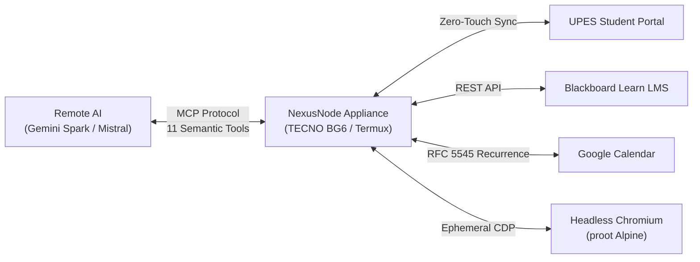

# NexusNode Master Complete Reference

> **Status**: VERIFIED CURRENT  
> **Scope**: Master consolidated architectural, operational, and protocol reference for NexusNode  
> **Last verified**: 2026-09-20 (Phase 4.2B Post-Rebase Audit)  
> **Evidence basis**: Synthesis of 10 Architecture Decision Records, 12 specialized reference documents, 6 architectural deep-dives, empirical benchmarks, and 687 test results

---

## 1. System Identity & Mission

**NexusNode** is an autonomous personal server appliance hosted on a dedicated mobile phone (**TECNO Spark Go 2024 / BG6**). It provides 24/7 background academic automation, UPES student portal integration, Blackboard Learn LMS ingestion, Google Calendar bi-directional timetable reconciliation, private Vault storage, and ephemeral browser execution.

NexusNode does **not** execute local LLM models on the device. Instead, it serves as an appliance exposing a rich **Model Context Protocol (MCP)** interface to external high-capability reasoning models (**Gemini Spark**, **Mistral**, etc.), bridging external intelligence to persistent student data and automation tools.



---

## 2. Master Document Index & Navigation

This master reference consolidates and cross-links the complete documentation suite:

### A. Foundational References (`docs/reference/`)
1. [`01_PROJECT_OVERVIEW.md`](file:///e:/Workspace/Active/server/docs/reference/01_PROJECT_OVERVIEW.md): Mission, core concepts, user personas, and component relationships.
2. [`02_REQUIREMENTS.md`](file:///e:/Workspace/Active/server/docs/reference/02_REQUIREMENTS.md): Functional and non-functional requirements, resource budgets, and SLA constraints.
3. [`03_CURRENT_ARCHITECTURE.md`](file:///e:/Workspace/Active/server/docs/reference/03_CURRENT_ARCHITECTURE.md): System architecture, execution tiers, and data boundaries.
4. [`04_IMPLEMENTATION_HISTORY.md`](file:///e:/Workspace/Active/server/docs/reference/04_IMPLEMENTATION_HISTORY.md): Historical evolution from Phase 1 through Phase 4.2B.
5. [`05_CONFIGURATION.md`](file:///e:/Workspace/Active/server/docs/reference/05_CONFIGURATION.md): Environment variables, secrets, path configurations, and defaults.
6. [`06_MCP_PROTOCOL_AND_SEMANTIC_FACADE.md`](file:///e:/Workspace/Active/server/docs/reference/06_MCP_PROTOCOL_AND_SEMANTIC_FACADE.md): Detailed specification of the 11 semantic tools (`nexus-semantic-v1`).
7. [`07_SECURITY_AND_GUARDRAILS.md`](file:///e:/Workspace/Active/server/docs/reference/07_SECURITY_AND_GUARDRAILS.md): RBAC, AES-GCM credential encryption, and Consequential Action Approval Grants.
8. [`08_DEPLOYMENT_AND_OPERATIONS.md`](file:///e:/Workspace/Active/server/docs/reference/08_DEPLOYMENT_AND_OPERATIONS.md): BG6 appliance setup, Termux, runit supervision, and tunnel management.
9. [`09_TESTING_AND_VERIFICATION.md`](file:///e:/Workspace/Active/server/docs/reference/09_TESTING_AND_VERIFICATION.md): Test architecture, 687-test audit results, and verification workflows.
10. [`10_ROADMAP.md`](file:///e:/Workspace/Active/server/docs/reference/10_ROADMAP.md): Completed milestones, near-term schedule (Phase 4.2C / 4.3), and planned capabilities.
11. [`GLOSSARY.md`](file:///e:/Workspace/Active/server/docs/reference/GLOSSARY.md): Authoritative definitions of system terms, protocols, and mechanisms.
12. [`PERFORMANCE_BASELINE.md`](file:///e:/Workspace/Active/server/docs/reference/PERFORMANCE_BASELINE.md): Measured hardware baselines, memory footprints, and browser benchmarks.

### B. Architectural Deep-Dives (`docs/architecture/`)
- [`SYSTEM_ARCHITECTURE.md`](file:///e:/Workspace/Active/server/docs/architecture/SYSTEM_ARCHITECTURE.md): Component topology, runtime communication, and request pipelines.
- [`ACADEMIC_ARCHITECTURE.md`](file:///e:/Workspace/Active/server/docs/architecture/ACADEMIC_ARCHITECTURE.md): Attendance formulas, calendar reconciliation, and portal scrapers.
- [`RESULTS_ARCHITECTURE.md`](file:///e:/Workspace/Active/server/docs/architecture/RESULTS_ARCHITECTURE.md): Academic results normalization, UPES 10-point scale, discrepancy detection, and What-If engine.
- [`SCHEDULER_AND_CALENDAR_ARCHITECTURE.md`](file:///e:/Workspace/Active/server/docs/architecture/SCHEDULER_AND_CALENDAR_ARCHITECTURE.md): 3-hour persistent cadence, failure isolation, LKG destructive protection, and idempotency.
- [`BROWSER_ARCHITECTURE.md`](file:///e:/Workspace/Active/server/docs/architecture/BROWSER_ARCHITECTURE.md): Ephemeral Chromium, CDP, accessibility tree sanitizer, and process reapers.
- [`MULTI_TENANT_ARCHITECTURE.md`](file:///e:/Workspace/Active/server/docs/architecture/MULTI_TENANT_ARCHITECTURE.md): Multi-user isolation, row-level security, and sandboxed storage.
- [`DATABASE_ARCHITECTURE.md`](file:///e:/Workspace/Active/server/docs/architecture/DATABASE_ARCHITECTURE.md): SQLite unified schema across all 42 tables, WAL mode, and indexes.
- [`AUTH_ARCHITECTURE.md`](file:///e:/Workspace/Active/server/docs/architecture/AUTH_ARCHITECTURE.md): Multi-tenant auth, session tokens, OAuth rotation, and approval challenges.

### C. Operational Manuals (`docs/operations/`)
- [`ACADEMIC_ACCOUNT_ONBOARDING.md`](file:///e:/Workspace/Active/server/docs/operations/ACADEMIC_ACCOUNT_ONBOARDING.md): 11-step Admin wizard, 10-point Student checklist, state-driven next action, and Google OAuth setup.
- [`RUNBOOK.md`](file:///e:/Workspace/Active/server/docs/operations/RUNBOOK.md): Day-to-day operations, service management, health checks, and log inspection.
- [`BACKUP_AND_RECOVERY.md`](file:///e:/Workspace/Active/server/docs/operations/BACKUP_AND_RECOVERY.md): SQLite online hot backups, integrity validation, and disaster recovery.
- [`TROUBLESHOOTING.md`](file:///e:/Workspace/Active/server/docs/operations/TROUBLESHOOTING.md): Diagnostic decision trees and failure resolution protocols.

### D. MCP & Protocol Specifications
- [`06_MCP_PROTOCOL_AND_SEMANTIC_FACADE.md`](file:///e:/Workspace/Active/server/docs/reference/06_MCP_PROTOCOL_AND_SEMANTIC_FACADE.md): Detailed specification of the 11 semantic tools (`nexus-semantic-v1`).
- [`MCP_CLIENT_COMPATIBILITY.md`](file:///e:/Workspace/Active/server/docs/reference/MCP_CLIENT_COMPATIBILITY.md): Frontier AI client adaptation (Gemini Spark, Mistral AI), schema typing, and consequential safety gates.

### E. Repository & Dead-Code Guides
- [`NEXUSNODE_ALL_FILES_GUIDE.md`](file:///e:/Workspace/Active/server/docs/NEXUSNODE_ALL_FILES_GUIDE.md): Directory-by-directory inventory mapping all repository files.
- [`LEGACY_AND_DEAD_CODE_AUDIT.md`](file:///e:/Workspace/Active/server/docs/LEGACY_AND_DEAD_CODE_AUDIT.md): Comprehensive audit of retired legacy/dead-code files.

---

## 3. Architecture Decision Records (ADRs) Summary

| ADR ID | Decision Title | Core Rationale | Status |
|---|---|---|---|
| **[ADR-001](file:///e:/Workspace/Active/server/docs/decisions/ADR-001-tecno-bg6-sole-appliance.md)** | TECNO BG6 as Sole Appliance | Low-cost, 24/7 power-efficient compute node; eliminates expensive cloud servers. | **ACCEPTED** |
| **[ADR-002](file:///e:/Workspace/Active/server/docs/decisions/ADR-002-remote-ai-reasoning-over-local-ollama.md)** | Remote AI over Local Ollama | Local LLMs cause severe memory exhaustion; remote models provide superior reasoning. | **ACCEPTED** |
| **[ADR-003](file:///e:/Workspace/Active/server/docs/decisions/ADR-003-mcp-first-external-intelligence-interface.md)** | MCP-First Interface | Standardized open protocol connecting external models directly to appliance state. | **ACCEPTED** |
| **[ADR-004](file:///e:/Workspace/Active/server/docs/decisions/ADR-004-semantic-facade-over-atomic-registry.md)** | Semantic Facade over Atomic Registry | Exposes 11 consolidated semantic tools, cutting token consumption by 74%. | **ACCEPTED** |
| **[ADR-005](file:///e:/Workspace/Active/server/docs/decisions/ADR-005-api-first-academic-execution.md)** | API-First Execution Router | 3-tier fallback (Cache -> HTTP -> Browser) maximizes speed and minimizes resource drain. | **ACCEPTED** |
| **[ADR-006](file:///e:/Workspace/Active/server/docs/decisions/ADR-006-ephemeral-chromium-instead-of-browser-daemon.md)** | Ephemeral Chromium Engine | Spawns headless browser on demand with strict reaper; eliminates memory leaks. | **ACCEPTED** |
| **[ADR-007](file:///e:/Workspace/Active/server/docs/decisions/ADR-007-multi-tenant-user-id-isolation.md)** | Multi-Tenant User Isolation | Row-level security across all 42 database tables prevents tenant cross-talk. | **ACCEPTED** |
| **[ADR-008](file:///e:/Workspace/Active/server/docs/decisions/ADR-008-consequential-action-approval-grants.md)** | Approval Grants for Consequential Actions | Requires cryptographic human token grants before executing destructive operations. | **ACCEPTED** |
| **[ADR-009](file:///e:/Workspace/Active/server/docs/decisions/ADR-009-shared-google-oauth-with-per-user-tokens.md)** | Shared Google OAuth / Per-User Tokens | Single appliance OAuth client with securely partitioned per-user tokens. | **ACCEPTED** |
| **[ADR-010](file:///e:/Workspace/Active/server/docs/decisions/ADR-010-first-party-dashboard-uses-rest-not-mcp.md)** | First-Party Dashboard Uses REST | Direct, fast REST endpoints for local UI; avoids LLM tool-calling overhead. | **ACCEPTED** |

---

## 4. Key Empirical Metrics (Phase 4.3A Production Baseline)

```
Hardware Platform:          TECNO Spark Go 2024 (Unisoc T606, 3.77 GB RAM, Android 13)
Server Process Footprint:   Python 3.14.6 / Waitress: 22 MB – 25 MB RSS
Database Footprint:         SQLite 3 (WAL Mode): 5.77 MB (42 tables, Migration 003 applied)
3-Hour Scheduler Cadence:   10,800s interval; executed across Timetable, Attendance, Results, LMS
Scheduler Memory Impact:    +4.19 MB RSS delta across full multi-subsystem pass; 0 Chromium launches
Browser Cold Start:         Mean 1,971.5 ms (~1.97s, stdev 70.1 ms)
Browser Clean Shutdown:     Mean 278.8 ms (100% clean shutdown, 0 orphan PIDs across all runs)
AX Tree Sanitization:       249.3 KB raw -> 6.8 KB sanitized (97.2% token reduction)
Test Suite Verification:    44 files, 725 collected, 724 passed, 0 failed, 1 skipped, 0 errors
Live Appliance Validation:  10/10 deployment steps verified; 7/7 live MCP tool calls passed (200 OK)
```
