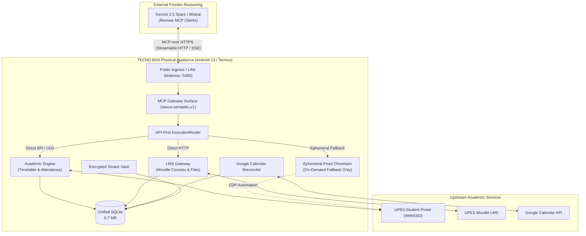

# 01. Project Overview

**Status:** VERIFIED CURRENT  
**Scope:** Production NexusNode Appliance Definition  
**Last verified:** 2026-09-20  
**Evidence basis:** Source code (`app.py`, `agent/`, `browser/`, `upes/`), Phase 4.2A UI rebase, live TECNO BG6 runtime  

---

## 1. Vision & Identity

NexusNode is an **autonomous personal academic MCP server appliance and local automation server**, engineered specifically to operate 24/7 on low-power mobile hardware (**TECNO BG6**, Android 13, Termux, aarch64, ~3.77 GB physical RAM).

NexusNode is **NOT** a local AI workstation, an Ollama manager, or a local chatbot. It does not run local large language models. Instead, it provides persistent, structured state, automated academic integrations, private cloud storage, and lightweight browser execution to external frontier models (e.g. Gemini Spark, Mistral) through the **Model Context Protocol (MCP)**.

---

## 2. Core Operational Principles

1. **Hardware Pragmatism (BG6-First)**:
   The physical TECNO BG6 smartphone is the **only permanently available compute appliance**. There is no permanent desktop worker, no secondary home server, and no paid cloud browser. All architectural decisions must preserve system stability under a ~3.77 GB RAM ceiling.

2. **Remote Intelligence, Local Authority**:
   Models propose, but tools execute locally. External AI models reason over academic context through MCP, but the local appliance enforces tenant boundaries, role-based authorization, rate limits, and consequential action approvals.

3. **API-First, Browser-Last**:
   Interactions with external academic systems strictly prefer direct HTTP APIs or Last-Known-Good (LKG) cached data. Headless Chromium is launched strictly as an ephemeral fallback when dynamic JavaScript rendering or interactive re-authentication is unavoidable.

4. **Zero Self-Approval for Consequential Actions**:
   No external AI agent can unilaterally execute irreversible academic actions (such as submitting an assignment or altering external portal state). Consequential operations require a cryptographically bound, human-issued `ApprovalGrant`.

5. **Multi-Tenant Scoping by Construction**:
   Every database query, credential store, Google OAuth token, Vault filesystem path, and browser profile is strictly partitioned by `user_id`. Cross-tenant data leakage is architecturally prohibited.

---

## 3. Appliance Capabilities Matrix

| Subsystem | Primary Responsibility | Upstream Dependencies | Local Storage / State |
| :--- | :--- | :--- | :--- |
| **MCP Gateway** | 11-tool semantic catalog (`nexus-semantic-v1`) for remote LLMs | External MCP clients (Gemini Spark, Claude) | In-memory tokens, SQLite audit log |
| **Academic Timetable** | Continuous schedule ingestion, room tracking, conflict detection | UPES WebSSO API | `user_timetables`, `academic_sessions` |
| **Attendance & Risk** | Official percentage tracking, punch logs, safe bunks planner | UPES Attendance API | `official_attendance_summaries`, `attendance_punches` |
| **Google Calendar** | Bidirectional timetable-to-calendar event synchronization | Google Calendar REST API v3 | `google_oauth_tokens`, `timetable_events_map` |
| **LMS Gateway** | Course discovery, assignment deadlines, lecture notes download | UPES Moodle LMS | `submission_plans`, Vault storage |
| **Tenant Vault** | Encrypted private file storage, uploads, directory organization | None (Local filesystem) | `storage_vault/users/{user_id}/` |
| **Ephemeral Browser** | Automated form navigation, SSO token extraction, screenshot capture | Chromium in Alpine proot | `browser/profiles/{user_id}/` |
| **Admin Diagnostics** | System telemetry, process supervision, memory governor, live logs | Linux `/proc`, `termux-services` (runit) | `system_logs` table, runit logs |

---

## 4. System Boundaries & Explicit Non-Goals

### What NexusNode Is:
- A compact, headless academic appliance running under Waitress WSGI.
- An OAuth 2.0 provider supporting RFC 9728 discovery for MCP clients.
- A deterministic rule engine for attendance recovery and safe bunk calculations.
- A secure multi-tenant student data store encrypted at rest.

### What NexusNode Is NOT:
- **NOT a local model runner**: Zero Ollama daemons, zero PyTorch/llama.cpp inference processes.
- **NOT an upstream agent framework**: Does not embed LangChain, AutoGen, or CrewAI on the appliance.
- **NOT a permanent browser host**: Chromium is never kept running as a background daemon.
- **NOT a public proxy**: Does not provide unrestricted web browsing or general internet proxying.
