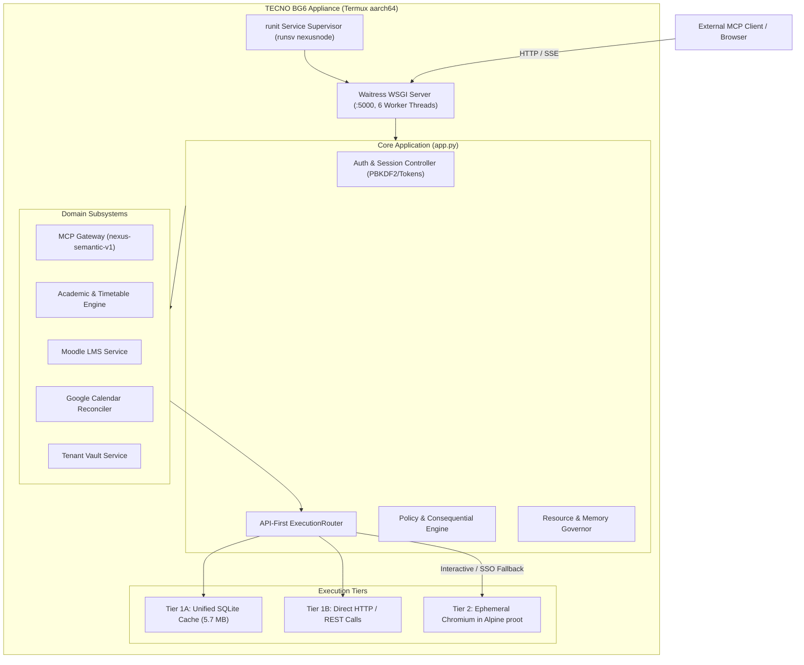

# 03. Current Architecture

**Status:** VERIFIED CURRENT  
**Scope:** Active Runtime Component Architecture & Interactions  
**Last verified:** 2026-09-20  
**Evidence basis:** Source code (`app.py`, `agent/`, `browser/`, `upes/`, `lms/`), Phase 4.2A UI, live BG6 audit  

---

## 1. High-Level Runtime Architecture

NexusNode executes as a multi-threaded Python WSGI application managed by Waitress on port 5000, supervised by `runsv` under Termux on the TECNO BG6 appliance.

---

## 2. Component Breakdown

### 2.1 Core Server & Supervisor
- **Supervisor**: `runsv /data/data/com.termux/files/usr/var/service/nexusnode`. Automatically respawns the Python server process upon unexpected termination, writing structured timestamped logs via `svlogd`.
- **WSGI Server**: [Waitress](https://docs.pylonsproject.org/projects/waitress) bound to `0.0.0.0:5000` with 6 worker threads, configured with a 500 MB upload ceiling.
- **Resource Governor** ([`resource_governor.py`](file:///E:/Workspace/Active/server/resource_governor.py)): Enforces hardware admission checks based on `/proc/meminfo` system memory pressure, caching telemetry snapshots with a 2.5s TTL.

### 2.2 Ingress & Protocol Surfaces
- **Web Dashboard**: 7 primary HTML5/ES6 views ([`index.html`](file:///E:/Workspace/Active/server/index.html), [`static/js/`](file:///E:/Workspace/Active/server/static/js/)) querying first-party REST endpoints (`/api/dashboard/summary`, `/api/mcp/summary`, `/api/lms/*`, `/files`).
- **Model Context Protocol (MCP)**: RFC 9728 compliant OAuth 2.0 authorization server and streamable HTTP/SSE endpoint ([`agent/mcp_server.py`](file:///E:/Workspace/Active/server/agent/mcp_server.py)) serving `nexus-semantic-v1`.
- **Public Ingress**: Managed via [LocalToNet](https://localtonet.com) (`localtonet.dll`) running as a supervised runit daemon, providing public HTTPS tunneling to port 5000.

### 2.3 Domain Services
- **Academic Engine** ([`timetable_sync.py`](file:///E:/Workspace/Active/server/timetable_sync.py), [`attendance_sync.py`](file:///E:/Workspace/Active/server/attendance_sync.py)): Manages timetable parsing, attendance calculation, safe bunk algorithms, and synchronization locks.
- **Academic Results & Performance Engine** ([`upes/results.py`](file:///E:/Workspace/Active/server/upes/results.py)): Evaluates UPES 10-point scale grades, SGPA, cumulative CGPA, dual normalization (ConnectPortal & Exam-Pro), discrepancy detection, and What-If GPA simulation.
- **3-Hour Automation Scheduler** ([`app.py`](file:///E:/Workspace/Active/server/app.py)): Coordinates persistent 3-hour automated synchronization across Timetable/Calendar, Attendance, Results, and LMS with independent subsystem failure containment.
- **UPES Authentication Manager** ([`upes/`](file:///E:/Workspace/Active/server/upes/)): Handles WebSSO session tokens, AES-256-GCM encrypted credentials, circuit breaking, and endurance tracking.
- **LMS Gateway** ([`lms/`](file:///E:/Workspace/Active/server/lms/), [`agent/lms_service.py`](file:///E:/Workspace/Active/server/agent/lms_service.py)): Connects to UPES Moodle LMS, tracking assignments and streaming course documents to Vault.
- **Google Calendar Reconciler** ([`timetable_sync.py`](file:///E:/Workspace/Active/server/timetable_sync.py)): Continuously reconciles timetable events with student Google Calendars using per-user encrypted tokens with LKG destructive protection.
- **Vault Service** ([`agent/vault_service.py`](file:///E:/Workspace/Active/server/agent/vault_service.py)): Provides multi-tenant private file storage isolated under `storage_vault/users/{user_id}/`.

### 2.4 Browser Execution Subsystem
- **Runtime** ([`browser/chromium_runtime.py`](file:///E:/Workspace/Active/server/browser/chromium_runtime.py), [`browser/bg6_cdp.py`](file:///E:/Workspace/Active/server/browser/bg6_cdp.py)): Executes Chromium 131 inside an Alpine Linux proot environment on Android. Operates strictly ephemerally under a single-flight file lock with process tree sweep cleanup.

---

## 3. Data Flow Topologies

For comprehensive step-by-step sequence diagrams and state transitions, see the authoritative subsystem specifications:
- **System Architecture & Processes**: [`docs/architecture/SYSTEM_ARCHITECTURE.md`](file:///E:/Workspace/Active/server/docs/architecture/SYSTEM_ARCHITECTURE.md)
- **Academic Execution & Reauth Lifecycle**: [`docs/architecture/ACADEMIC_ARCHITECTURE.md`](file:///E:/Workspace/Active/server/docs/architecture/ACADEMIC_ARCHITECTURE.md)
- **Academic Results & SGPA/CGPA Architecture**: [`docs/architecture/RESULTS_ARCHITECTURE.md`](file:///E:/Workspace/Active/server/docs/architecture/RESULTS_ARCHITECTURE.md)
- **Scheduler & Calendar Reconciliation Architecture**: [`docs/architecture/SCHEDULER_AND_CALENDAR_ARCHITECTURE.md`](file:///E:/Workspace/Active/server/docs/architecture/SCHEDULER_AND_CALENDAR_ARCHITECTURE.md)
- **Guided Academic Account Onboarding**: [`docs/operations/ACADEMIC_ACCOUNT_ONBOARDING.md`](file:///E:/Workspace/Active/server/docs/operations/ACADEMIC_ACCOUNT_ONBOARDING.md)
- **MCP Client Compatibility & Protocol Invariants**: [`docs/reference/MCP_CLIENT_COMPATIBILITY.md`](file:///E:/Workspace/Active/server/docs/reference/MCP_CLIENT_COMPATIBILITY.md)
- **Browser Runtime & CDP Execution**: [`docs/architecture/BROWSER_ARCHITECTURE.md`](file:///E:/Workspace/Active/server/docs/architecture/BROWSER_ARCHITECTURE.md)
- **Multi-Tenant Scoping & Security**: [`docs/architecture/MULTI_TENANT_ARCHITECTURE.md`](file:///E:/Workspace/Active/server/docs/architecture/MULTI_TENANT_ARCHITECTURE.md)
- **Database Schema & Persistence**: [`docs/architecture/DATABASE_ARCHITECTURE.md`](file:///E:/Workspace/Active/server/docs/architecture/DATABASE_ARCHITECTURE.md)
- **MCP Protocol & Semantic Tools**: [`docs/reference/06_MCP_PROTOCOL_AND_SEMANTIC_FACADE.md`](file:///E:/Workspace/Active/server/docs/reference/06_MCP_PROTOCOL_AND_SEMANTIC_FACADE.md)
