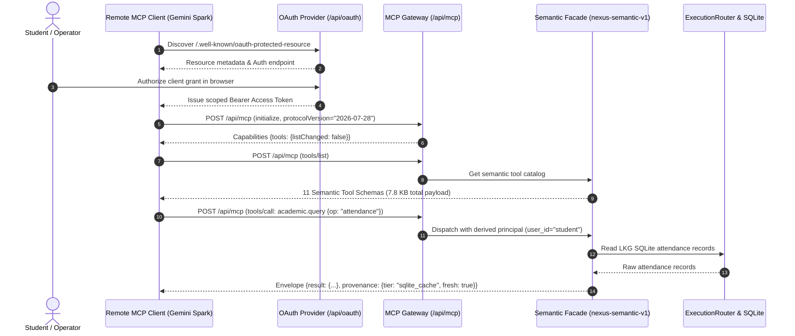

# 06. MCP Protocol & Semantic Facade Specification

**Status:** VERIFIED CURRENT  
**Scope:** Model Context Protocol Gateway & `nexus-semantic-v1` Catalog  
**Last verified:** 2026-09-20  
**Evidence basis:** [`agent/semantic_facade.py`](file:///E:/Workspace/Active/server/agent/semantic_facade.py), [`agent/mcp_server.py`](file:///E:/Workspace/Active/server/agent/mcp_server.py), `tests/test_semantic_facade.py`  

---

## 1. Protocol Architecture & Standards Compliance

NexusNode implements Anthropic's [Model Context Protocol (MCP)](https://modelcontextprotocol.io/) as the standardized interface for remote AI reasoning engines (e.g. Gemini 2.5 Spark, Claude, Mistral).

### 1.1 Ingress & Transports
- **Primary Endpoint**: `/api/mcp` (HTTP POST with JSON-RPC 2.0 payloads).
- **Streaming SSE Transport**: `/sse` (Server-Sent Events) for real-time notification streams and progress tokens.
- **Protocol Versions**:
  - `2026-07-28` (Current Authoritative Protocol negotiated with Gemini Spark).
  - `2024-11-05` (Legacy Standard Fallback).

### 1.2 OAuth 2.0 & RFC 9728 Discovery
To enable autonomous discovery by remote MCP clients without manual token pasting, NexusNode implements RFC 9728 OAuth 2.0 Protected Resource Metadata:
- **Authorization Server Metadata**: `/.well-known/oauth-authorization-server`
- **Protected Resource Metadata**: `/.well-known/oauth-protected-resource`
- **Token Endpoint**: `/api/oauth/token` (Supports `authorization_code` and `refresh_token` grants).



---

## 2. Authoritative 11-Tool Semantic Matrix (`nexus-semantic-v1`)

The external MCP attack surface is consolidated from 43+ internal atomic functions into exactly **11 high-order semantic tools**:

| # | Tool Name | Intent / Operations | Internal Atomic Targets | Access | Browser Possible? | Consequential? | Human Approval? | Tenant Scoped? |
| :- | :--- | :--- | :--- | :--- | :--- | :--- | :--- | :--- |
| 1 | `nexus.status` | System health, RAM telemetry, storage, scheduler, browser availability | `nexus.status` | Read | No | No | No | Global / Appliance |
| 2 | `academic.query` | Query timetable, upcoming classes, official attendance, punch logs, courses, examination results, SGPA/CGPA | `upes.get_timetable`, `upes.get_attendance`, `upes.get_punches`, `upes.get_courses`, `upes.get_results` | Read | No (Pure API/Cache) | No | No | Yes (`user_id`) |
| 3 | `academic.sync` | Synchronize timetable, attendance, Google Calendar events, or academic results | `upes.timetable.sync`, `upes.attendance.sync`, `calendar.reconcile`, `upes.results.sync` | Write | **Yes** (Reauth only) | No | No | Yes (`user_id`) |
| 4 | `academic.analyze`| Calculate safe bunks, recovery classes, attendance deficits, CGPA/SGPA analysis, and What-If GPA projections | `upes.calculate_attendance`, `upes.analyze_performance`, `upes.calculate_what_if` | Read | No | No | No | Yes (`user_id`) |
| 5 | `lms.query` | Browse enrolled Moodle courses, assignments, deadlines, and course resources | `lms.list_courses`, `lms.list_assignments`, `lms.get_assignment` | Read | No (Direct HTTP) | No | No | Yes (`user_id`) |
| 6 | `lms.fetch` | Stream lecture notes, assignment briefs, and syllabi directly into Vault | `lms.download_resource` | Write | No (Direct HTTP) | No | No | Yes (`user_id`) |
| 7 | `lms.prepare` | Inspect assignment rubric, stage file, and draft submission plan (dry-run) | `lms.prepare_submission` | Write | No | **Yes** (Staged) | No (Staging only)| Yes (`user_id`) |
| 8 | `vault.manage` | List, search, read, write, create, move, copy, rename, or mkdir in Vault | `vault.list`, `vault.read`, `vault.write`, `vault.mkdir`, `vault.rename` | Read/Write| No | Partial (Write/Del) | No (Tenant root) | Yes (`user_id`) |
| 9 | `document.process`| Extract structured text/metadata from documents; generate output files | `document.extract`, `document.create` | Read/Write| No | No | No | Yes (`user_id`) |
| 10| `browser.interact`| Ephemeral headless browser interaction: open, navigate, snapshot, click, type | `browser.open`, `browser.navigate`, `browser.snapshot`, `browser.click` | Read/Write| **YES (Required)** | **YES** | Conditional | Yes (`user_id`) |
| 11| `action.status` | Inspect status of staged submission plans and active approval grants | `action.status` | Read | No | No | No | Yes (`user_id`) |

For full frontier model adaptation rules (Gemini Spark & Mistral), see [MCP Client Compatibility](file:///E:/Workspace/Active/server/docs/reference/MCP_CLIENT_COMPATIBILITY.md).

---

## 3. Protocol Invariants & Guardrails

### 3.1 Strict Tenant Derivation (Zero Client Override)
Remote MCP clients frequently attempt to inject target parameters such as `{"user_id": "other_student"}`.
- **Invariant**: The `SemanticFacade` unconditionally discards any client-supplied `user_id`. The executing `user_id` is derived strictly from the authenticated OAuth Bearer token.
- **Enforcement**:
  ```python
  # agent/semantic_facade.py
  derived_user_id = principal.get("user_id")
  arguments.pop("user_id", None)  # Strip client override attempts
  arguments["user_id"] = derived_user_id
  ```

### 3.2 Zero Self-Approval Invariant
- Remote AI agents cannot approve their own consequential actions.
- There is no `action.approve` tool in `nexus-semantic-v1`.
- Any attempt by a remote client to call approval endpoints returns JSON-RPC method not found (`-32601`). Approval grants must be created out-of-band by a human user through the web interface.

### 3.3 Provenance Envelope
Every successful semantic tool call wraps its payload in a standardized provenance envelope:
```json
{
  "status": "success",
  "data": { ... },
  "provenance": {
    "source": "nexus-semantic-v1",
    "tier": "sqlite_cache",
    "timestamp": 1726839400.12,
    "freshness": "authoritative",
    "latency_ms": 14.2
  }
}
```

### 3.4 Error Normalization
Exceptions, upstream network drops, and validation failures are normalized into structured JSON-RPC error objects. Internal Python stack traces and sensitive server paths are stripped before delivery to the client.
