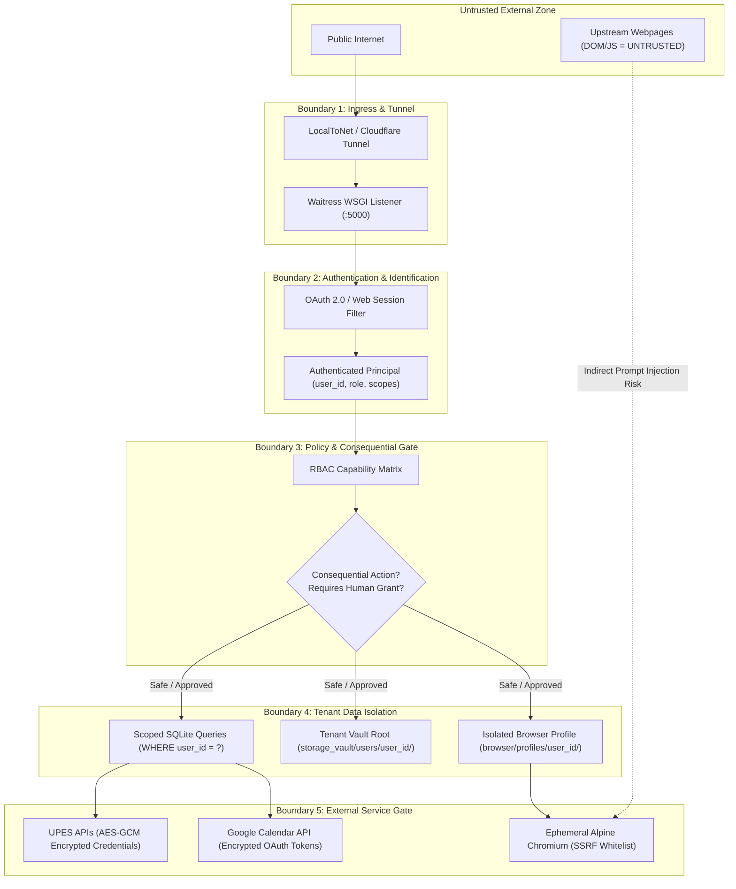

# 07. Security & Guardrails Specification

**Status:** VERIFIED CURRENT  
**Scope:** Threat Model, Boundary Protections & Safety Invariants  
**Last verified:** 2026-09-20  
**Evidence basis:** [`agent/policy.py`](file:///E:/Workspace/Active/server/agent/policy.py), [`agent/consequential.py`](file:///E:/Workspace/Active/server/agent/consequential.py), `tests/test_consequential_actions.py`, `tests/test_multi_user_isolation.py`  

---

## 1. Threat Model & Security Boundaries

NexusNode enforces strict defense-in-depth across six distinct architectural boundaries:

### Trust Classification Matrix
- **Internet Clients**: UNTRUSTED until valid Bearer token or authenticated session cookie is presented.
- **Remote MCP Clients (e.g. Gemini Spark)**: AUTHENTICATED, but **NOT TRUSTED** to self-approve consequential actions or access cross-tenant data.
- **Webpage Content / Upstream DOM**: STRICTLY UNTRUSTED. Treated as untrusted input to prevent indirect prompt injection.
- **Student Tenants**: Scoped to their own `user_id`. Cannot inspect or modify peers' records.
- **Administrator**: Privileged. Governs appliance health, diagnostic logs, and service supervision.

---

## 2. Permanent Security Invariants

1. **No Cross-Tenant Data Access**: No database query, filesystem operation, or browser profile access may execute without binding to the authenticated `user_id`.
2. **Zero Plaintext Secrets at Rest**: Passwords, OAuth client secrets, and access tokens must be stored encrypted using PBKDF2-HMAC-SHA256 derived keys and AES-256-GCM authenticated encryption.
3. **Zero Secret Leakage in Telemetry & Context**: Passwords, cookies, tokens, and authorization headers must be stripped from system logs, REST error responses, and MCP prompt contexts.
4. **Zero AI Self-Approval**: Consequential actions require an explicit human `ApprovalGrant`. No API or MCP tool exists allowing an AI model to approve its own actions.
5. **No Browser Bypass of Consequential Policy**: An agent cannot bypass approval gates by issuing low-level browser click commands (`browser.interact`) on submission buttons.
6. **No False Success Without Evidence**: Academic sync operations must return evidence (timestamps, record counts, HTTP status codes); operations that fail or fall back to cache must truthfully report LKG status.
7. **LKG Destructive Protection**: Empty, malformed, or stale timetable responses strictly enforce `allow_deletions = False` during calendar reconciliation, permanently preventing accidental wiping of student schedules.
8. **Zero Chromium Background Invariant**: Normal 3-hour background synchronization executes exclusively via direct HTTP/APIs with exactly 0 Chromium browser launches. Chromium execution is restricted to isolated interactive re-authentication fallbacks.

---

## 3. Consequential Action Protocol & Approval Lifecycle

Consequential actions (e.g. submitting an LMS assignment, deleting files, committing grades) follow an immutable two-phase commit lifecycle:

```mermaid
stateDiagram-v2
    [*] --> Prepared: Agent calls lms.prepare (dry-run)
    Prepared --> ApprovalRequested: System hashes params & issues ApprovalRequest
    ApprovalRequested --> Approved: Human reviews & grants ApprovalGrant in Web UI
    ApprovalRequested --> Rejected: Human rejects or TTL expires (15m)
    Approved --> Executing: Agent calls execution with Grant ID + Params
    Executing --> Aborted: Parameter digest mismatch! (Tamper detected)
    Executing --> Committed: Parameters match; Action executes
    Committed --> [*]: Grant burned (single-use); Audit logged
    Rejected --> [*]: Aborted
    Aborted --> [*]: Aborted
```

### 3.1 Immutable Parameter Digest
When an action is staged, a canonical SHA-256 hash is computed over the normalized JSON parameters:
$$\text{Digest} = \text{SHA-256}\left(\text{JSON}_{\text{canonical}}(\text{action}, \text{target}, \text{payload})\right)$$
At execution time, the digest is recomputed. Any parameter modification (e.g. changing the submission file or target assignment ID) aborts execution with an `APPROVAL_PARAMETER_MISMATCH` error.

---

## 4. Vault Boundary: User-Visible Vault vs Internal Storage

> [!WARNING]
> **Architectural Distinction**:
> `storage_vault` is the host filesystem directory for the appliance. It is **NOT** the student Vault.

- **User-Visible Vault (`storage_vault/users/{user_id}/`)**:
  - Accessible to students and tenant-scoped MCP tools (`vault.manage`).
  - Contains user documents, study guides, downloaded lecture notes, and staged submissions.
  - Strictly sandboxed: paths resolving outside the tenant root throw `PATH_TRAVERSAL_DETECTED`.
- **Internal Storage Infrastructure (`storage_vault/`)**:
  - `storage_vault/nexus_unified.db`: Authoritative unified SQLite database.
  - `storage_vault/backups/`: Database dumps and snapshot archives.
  - `storage_vault/.nexus_secret`: Appliance cryptographic master key.
  - `storage_vault/artifacts/`: System benchmark logs, screenshots, and telemetry dumps.
  - Inaccessible via `vault.manage` or student REST endpoints.
