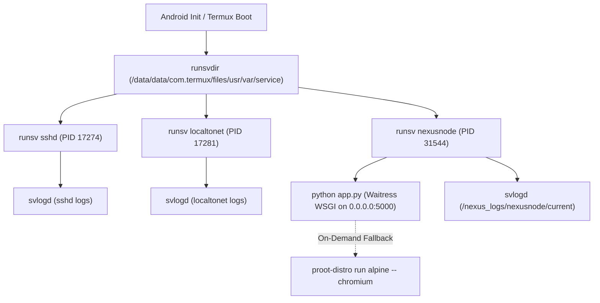

# 08. Deployment & Operations Specification

**Status:** VERIFIED CURRENT  
**Scope:** Appliance Deployment Topology, Service Supervision & Operations  
**Last verified:** 2026-09-20  
**Evidence basis:** Live BG6 forensic audit, `services/nexusnode/run`, `deploy_phase42a.py`, `runsv` status  

---

## 1. Physical Appliance Specifications

- **Hardware Platform**: TECNO BG6 (TECNO Mobile Limited)
- **Host Operating System**: Android 13 (Linux kernel `5.4.210-android12-9-667269-g856cdf2f247e-ab190`)
- **CPU Architecture**: `aarch64` (64-bit ARM)
- **Physical Memory**: 3,771 MB total RAM (~1.6–1.7 GB available under normal load)
- **Swap / ZRAM**: 2,828 MB total ZRAM (~1.4 GB available)
- **Internal Storage**: 53 GB Flash storage (~31 GB free available on `/data`)
- **Appliance Network Access**:
  - **Local LAN**: Current observed LAN address: `192.168.29.21` (SSH port: `8022`, HTTP port: `5000`).
  - **Public Ingress**: [LocalToNet](https://localtonet.com) tunnel (`k09oezeyib.localto.net`).

---

## 2. Process Tree & Service Supervision

The appliance utilizes Termux's standard `runit` supervision system (`termux-services`):



### 2.1 Service Directory Paths
- **Service Run Definitions**: `/data/data/com.termux/files/usr/var/service/nexusnode/run`
- **Log Service**: `/data/data/com.termux/files/usr/var/service/nexusnode/log/run`
- **Log Storage**: `/data/data/com.termux/files/home/nexus_logs/nexusnode/current`
- **Server Application Root**: `/data/data/com.termux/files/home/server`

---

## 3. Operations Procedures

### 3.1 Service Control Commands
All service management on the BG6 is performed via standard `sv` commands:

```bash
# Check service status
sv status /data/data/com.termux/files/usr/var/service/nexusnode

# Restart the NexusNode server
sv restart /data/data/com.termux/files/usr/var/service/nexusnode

# Stop the server
sv stop /data/data/com.termux/files/usr/var/service/nexusnode

# Start the server
sv start /data/data/com.termux/files/usr/var/service/nexusnode

# Inspect live log stream
tail -f /data/data/com.termux/files/home/nexus_logs/nexusnode/current
```

### 3.2 Pre-Deployment Backup Procedure
Before uploading any code changes or schema migrations to the appliance:
```bash
# Create timestamped pre-deployment tarball
TS=$(date +%Y%m%d_%H%M%S)
BACKUP_FILE="/data/data/com.termux/files/home/backups/phase4_migration/nexusnode_pre_deploy_${TS}.tar.gz"
mkdir -p "$(dirname "$BACKUP_FILE")"
tar -czf "$BACKUP_FILE" -C /data/data/com.termux/files/home/server app.py index.html static storage_vault/nexus_unified.db
```

### 3.3 Rollback Procedure
If a deployment fails verification or causes crashes:
```bash
# Stop the supervised service
sv stop /data/data/com.termux/files/usr/var/service/nexusnode

# Extract target backup over server directory
tar -xzf /data/data/com.termux/files/home/backups/phase4_migration/TARGET_BACKUP.tar.gz -C /data/data/com.termux/files/home/server

# Restart service
sv start /data/data/com.termux/files/usr/var/service/nexusnode
```

### 3.4 Automated Health Checks
The appliance exposes an unauthenticated lightweight health check endpoint:
```bash
curl -s http://127.0.0.1:5000/api/system/status
```
Expected response:
```json
{
  "status": "healthy",
  "device": "TECNO BG6 (Android 13 / Termux)",
  "uptime_seconds": 1132,
  "version": "2.3.8"
}
```
